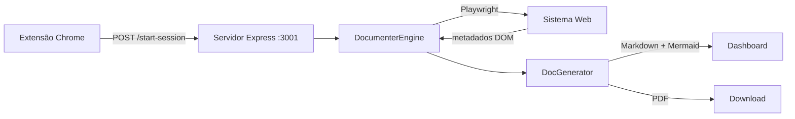

# 📚 System Documenter Agent

> Documentação automática de sistemas web — telas, regras de negócio e fluxogramas gerados via Playwright + extensão Chrome.

---

## ✨ O que é

O **System Documenter Agent** é uma ferramenta de automação que navega pelo seu sistema web e gera automaticamente:

- 📋 **Manual de Telas** — título, URL, campos, botões e selects de cada página
- ⚠️ **Regras de Negócio** — validações capturadas diretamente do DOM (mensagens de erro nativas e customizadas)
- 🔀 **Fluxograma Visual** — diagrama Mermaid do fluxo de navegação entre telas
- 📄 **Relatório PDF** — documentação exportável pronta para entrega

> Este projeto é **separado e independente** do [QA Auditor Agent](https://github.com/mjr0/QA-Auditor-Agent), que foca em erros técnicos (console, rede, performance). Aqui o foco é puramente documental.

---

## 🏗️ Arquitetura

```
System Documenter Agent
├── src/
│   ├── documenter/
│   │   └── DocumenterEngine.ts   # Motor principal (Playwright)
│   ├── report/
│   │   ├── DocGenerator.ts       # Gerador de Markdown + Mermaid
│   │   └── PdfGenerator.ts       # Exportação para PDF
│   ├── types/
│   │   └── documenter.ts         # Tipos: PageDocData, FlowTransition, BusinessRule
│   ├── public/
│   │   └── dashboard.html        # Dashboard 5 abas (Telas, Regras, Fluxo, PDF...)
│   ├── server.ts                 # Servidor Express (porta 3001)
│   └── index.ts                  # Ponto de entrada CLI
├── chrome-extension/             # Extensão Chrome para disparo manual
│   ├── manifest.json
│   ├── popup.html
│   └── popup.js
├── profiles.json                 # Perfis de login por sistema
└── iniciar_servidor.bat          # Atalho Windows para iniciar o servidor
```

---

## 🚀 Início Rápido

### Pré-requisitos

- [Node.js](https://nodejs.org/) 18+
- [Playwright](https://playwright.dev/) (instalado via `npm install`)

### Instalação

```bash
git clone https://github.com/mjr0/System-Documenter---Agent.git
cd System-Documenter---Agent
npm install
npx playwright install chromium
```

### Configuração

Crie o arquivo `.env` na raiz do projeto:

```env
TARGET_URL=https://seu-sistema.com
USERNAME=seu_usuario
PASSWORD=sua_senha
```

### Iniciar o servidor

```bash
npm run server
# Servidor rodando em http://localhost:3001
```

Ou use o atalho Windows: **duplo clique em `iniciar_servidor.bat`**

### Dashboard

Acesse **http://localhost:3001/dashboard** no navegador.

---

## 🔌 Extensão Chrome

1. Abra `chrome://extensions/` no Chrome
2. Ative o **Modo do desenvolvedor**
3. Clique em **Carregar sem compactação**
4. Selecione a pasta `chrome-extension/`

A extensão se conecta automaticamente ao servidor na porta `3001` e permite disparar o mapeamento de telas diretamente do navegador.

---

## 📦 Scripts disponíveis

| Comando | Descrição |
|---|---|
| `npm run build` | Compila o TypeScript |
| `npm run server` | Inicia o servidor Express na porta `3001` |
| `npm run audit` | Executa o DocumenterEngine em modo CLI |
| `npm run audit:headed` | Executa com browser visível |
| `npm run audit:pages` | Documenta múltiplas páginas |

---

## 🧠 Como funciona



1. A extensão Chrome envia a URL-alvo para o servidor
2. O `DocumenterEngine` navega pelas telas via Playwright
3. Extrai campos, botões, labels e dispara submissões para capturar validações
4. O `DocGenerator` monta o Markdown com diagrama Mermaid
5. O Dashboard exibe tudo em 5 abas interativas

---

## 🆚 Diferença entre System Documenter e QA Auditor

| | **System Documenter** | **QA Auditor** |
|---|---|---|
| **Porta** | `3001` | `3000` |
| **Foco** | Documentação do sistema | Bugs e erros técnicos |
| **Output** | Manual + Fluxograma + PDF | Relatório de erros |
| **Captura** | Campos, regras, fluxo | Console, rede, performance |

---

## 📄 Licença

ISC
