# 📘 Especificação e Documentação Técnica do Sistema

Este manual técnico detalha as telas, formulários, fluxos de navegação e regras de validação mapeados de forma automatizada.

## ⚙️ Informações Gerais do Sistema

*   **Sistema**: `QA Auditor Agent - Aluno Presente`
*   **URL Base**: [https://alunopresente.servicent.com.br](https://alunopresente.servicent.com.br)
*   **Data de Geração**: 21/06/2026 às 23:22:27
*   **Total de Telas Mapeadas**: 26
*   **Total de Regras de Validação Catalogadas**: 0

---

## 🗺️ Mapa de Navegação e Rotas do Sistema (Fluxograma)

Abaixo está o diagrama visual gerado automaticamente que ilustra os caminhos e transições de tela rastreados no sistema.

```mermaid
graph TD
  _dashboard["/dashboard (/dashboard)"]
  _alunopresente_dashboard_unidadeEscolar["Dashboard - Unidade Escolar (/alunopresente/dashboard-unidadeEscolar)"]
  _dashboard -->|"Navegar para Dashboard - Unidade Escolar"| _alunopresente_dashboard_unidadeEscolar
  _alunopresente_dashboard_analise_diaria["Dashboard - Análise Diária (/alunopresente/dashboard-analise-diaria)"]
  _alunopresente_dashboard_unidadeEscolar -->|"Navegar para Dashboard - Análise Diária"| _alunopresente_dashboard_analise_diaria
  _alunopresente_dashboard_refeitorio_diario["Dashboard - Refeitório Diário (/alunopresente/dashboard-refeitorio-diario)"]
  _alunopresente_dashboard_analise_diaria -->|"Navegar para Dashboard - Refeitório Diário"| _alunopresente_dashboard_refeitorio_diario
  _alunopresente_dashboard_secretario["Dashboard - Visão Secretaria (/alunopresente/dashboard-secretario)"]
  _alunopresente_dashboard_refeitorio_diario -->|"Navegar para Dashboard - Visão Secretaria"| _alunopresente_dashboard_secretario
  _alunopresente_dashboard_aluno["Dashboard - Analítico Aluno (/alunopresente/dashboard-aluno)"]
  _alunopresente_dashboard_secretario -->|"Navegar para Dashboard - Analítico Aluno"| _alunopresente_dashboard_aluno
  _alunopresente_dashboard_analitico_recorrencia["Dashboard - Analítico Recorrência (/alunopresente/dashboard-analitico-recorrencia)"]
  _alunopresente_dashboard_aluno -->|"Navegar para Dashboard - Analítico Recorrência"| _alunopresente_dashboard_analitico_recorrencia
  _alunopresente_dashboard_analitico_ausencia["Dashboard - Analítico Ausências (/alunopresente/dashboard-analitico-ausencia)"]
  _alunopresente_dashboard_analitico_recorrencia -->|"Navegar para Dashboard - Analítico Ausências"| _alunopresente_dashboard_analitico_ausencia
  _alunopresente_dashboard_analitico_atrasos["Dashboard - Analítico Atrasos (/alunopresente/dashboard-analitico-atrasos)"]
  _alunopresente_dashboard_analitico_ausencia -->|"Navegar para Dashboard - Analítico Atrasos"| _alunopresente_dashboard_analitico_atrasos
  _alunopresente_listar_monitoramento_fotos["Dashboard - Monitoramento Fotos (/alunopresente/listar-monitoramento-fotos)"]
  _alunopresente_dashboard_analitico_atrasos -->|"Navegar para Dashboard - Monitoramento Fotos"| _alunopresente_listar_monitoramento_fotos
  _mapa_situacao_operacional["Dashboard - Situação Operacional (/mapa/situacao-operacional)"]
  _alunopresente_listar_monitoramento_fotos -->|"Navegar para Dashboard - Situação Operacional"| _mapa_situacao_operacional
  _mapa_acompanhamento_operacional["Acompanhamento Operacional (/mapa/acompanhamento-operacional)"]
  _mapa_situacao_operacional -->|"Navegar para Acompanhamento Operacional"| _mapa_acompanhamento_operacional
  _relatorios_evolucao_fotos["Relatório - Evolução de fotos (/relatorios/evolucao-fotos)"]
  _mapa_acompanhamento_operacional -->|"Navegar para Relatório - Evolução de fotos"| _relatorios_evolucao_fotos
  _relatorios_evolucao_mensal["Relatório - Evolução Mensal (/relatorios/evolucao-mensal)"]
  _relatorios_evolucao_fotos -->|"Navegar para Relatório - Evolução Mensal"| _relatorios_evolucao_mensal
  _relatorios_evolucao_mensal -->|"Navegar para Dashboard - Unidade Escolar"| _alunopresente_dashboard_unidadeEscolar
  _alunopresente_dashboard_unidadeEscolar -->|"Navegar para Dashboard - Análise Diária"| _alunopresente_dashboard_analise_diaria
  _alunopresente_dashboard_analise_diaria -->|"Navegar para Dashboard - Refeitório Diário"| _alunopresente_dashboard_refeitorio_diario
  _alunopresente_dashboard_refeitorio_diario -->|"Navegar para Dashboard - Visão Secretaria"| _alunopresente_dashboard_secretario
  _alunopresente_dashboard_secretario -->|"Navegar para Dashboard - Analítico Aluno"| _alunopresente_dashboard_aluno
  _alunopresente_dashboard_aluno -->|"Navegar para Dashboard - Analítico Recorrência"| _alunopresente_dashboard_analitico_recorrencia
  _alunopresente_dashboard_analitico_recorrencia -->|"Navegar para Dashboard - Analítico Ausências"| _alunopresente_dashboard_analitico_ausencia
  _alunopresente_dashboard_analitico_ausencia -->|"Navegar para Dashboard - Analítico Atrasos"| _alunopresente_dashboard_analitico_atrasos
  _alunopresente_dashboard_analitico_atrasos -->|"Navegar para Dashboard - Monitoramento Fotos"| _alunopresente_listar_monitoramento_fotos
  _alunopresente_listar_monitoramento_fotos -->|"Navegar para Dashboard - Situação Operacional"| _mapa_situacao_operacional
  _mapa_situacao_operacional -->|"Navegar para Acompanhamento Operacional"| _mapa_acompanhamento_operacional
  _mapa_acompanhamento_operacional -->|"Navegar para Relatório - Evolução de fotos"| _relatorios_evolucao_fotos
  _relatorios_evolucao_fotos -->|"Navegar para Relatório - Evolução Mensal"| _relatorios_evolucao_mensal
```

---

## 📋 Catálogo de Regras de Negócio e Validações

Validações identificadas nos campos de entrada do sistema (regras do HTML5 ou geradas por comportamentos e mensagens de erro do sistema):

*ℹ️ Nenhuma validação ou regra de preenchimento foi mapeada nesta execução.*

---

## 🖥️ Detalhamento Técnico das Telas

### Tela: Dashboard - Unidade Escolar

*   **Rota**: `/alunopresente/dashboard-unidadeEscolar`
*   **Título HTML da Página**: `Aluno Presente`
*   **Cabeçalho Principal (H1)**: `Dashboard Unidade Escolar`

#### 🎯 Objetivo e Funcionalidade da Tela

*   **Objetivo de Negócio**: Apresentar uma visão geral consolidada da frequência escolar diária na escola selecionada.
*   **Perfis / Papéis Recomendados**: `Diretor Escolar`, `Coordenador Pedagógico`, `Secretário de Escola`
*   **Principais Ações e Recursos Mapeados**:
    - Visualização rápida de alunos presentes e ausentes por turma no dia atual
    - Acompanhamento gráfico da frequência acumulada por período
    - Filtro rápido por turmas e séries da unidade

#### 📝 Campos de Entrada (Formulário)

| Rótulo / Descrição | Tipo | Atributo Name | Placeholder / Exemplo | Validações Mapeadas |
| :--- | :--- | :--- | :--- | :--- |
| Light | `radio` | `theme-style` | *(Vazio)* | *(Nenhuma)* |
| Dark | `radio` | `theme-style` | *(Vazio)* | *(Nenhuma)* |
| LTR | `radio` | `direction` | *(Vazio)* | *(Nenhuma)* |
| RTL | `radio` | `direction` | *(Vazio)* | *(Nenhuma)* |
| Vertical | `radio` | `navigation-style` | *(Vazio)* | *(Nenhuma)* |
| Horizontal | `radio` | `navigation-style` | *(Vazio)* | *(Nenhuma)* |
| Menu Click | `radio` | `navigation-data-menu-styles` | *(Vazio)* | *(Nenhuma)* |
| Menu Hover | `radio` | `navigation-data-menu-styles` | *(Vazio)* | *(Nenhuma)* |
| Icon Click | `radio` | `navigation-data-menu-styles` | *(Vazio)* | *(Nenhuma)* |
| Icon Hover | `radio` | `navigation-data-menu-styles` | *(Vazio)* | *(Nenhuma)* |
| Default Menu | `radio` | `sidemenu-layout-styles` | *(Vazio)* | *(Nenhuma)* |
| Closed Menu | `radio` | `sidemenu-layout-styles` | *(Vazio)* | *(Nenhuma)* |
| Icon Text | `radio` | `sidemenu-layout-styles` | *(Vazio)* | *(Nenhuma)* |
| Icon Overlay | `radio` | `sidemenu-layout-styles` | *(Vazio)* | *(Nenhuma)* |
| Detached | `radio` | `sidemenu-layout-styles` | *(Vazio)* | *(Nenhuma)* |
| Double Menu | `radio` | `sidemenu-layout-styles` | *(Vazio)* | *(Nenhuma)* |
| Regular | `radio` | `data-page-styles` | *(Vazio)* | *(Nenhuma)* |
| Classic | `radio` | `data-page-styles` | *(Vazio)* | *(Nenhuma)* |
| Modern | `radio` | `data-page-styles` | *(Vazio)* | *(Nenhuma)* |
| FullWidth | `radio` | `layout-width` | *(Vazio)* | *(Nenhuma)* |
| Boxed | `radio` | `layout-width` | *(Vazio)* | *(Nenhuma)* |
| Fixed | `radio` | `data-menu-positions` | *(Vazio)* | *(Nenhuma)* |
| Scrollable | `radio` | `data-menu-positions` | *(Vazio)* | *(Nenhuma)* |
| Fixed | `radio` | `data-header-positions` | *(Vazio)* | *(Nenhuma)* |
| Scrollable | `radio` | `data-header-positions` | *(Vazio)* | *(Nenhuma)* |
| menu-colors | `radio` | `menu-colors` | *(Vazio)* | *(Nenhuma)* |
| menu-colors | `radio` | `menu-colors` | *(Vazio)* | *(Nenhuma)* |
| menu-colors | `radio` | `menu-colors` | *(Vazio)* | *(Nenhuma)* |
| menu-colors | `radio` | `menu-colors` | *(Vazio)* | *(Nenhuma)* |
| menu-colors | `radio` | `menu-colors` | *(Vazio)* | *(Nenhuma)* |
| header-colors | `radio` | `header-colors` | *(Vazio)* | *(Nenhuma)* |
| header-colors | `radio` | `header-colors` | *(Vazio)* | *(Nenhuma)* |
| header-colors | `radio` | `header-colors` | *(Vazio)* | *(Nenhuma)* |
| header-colors | `radio` | `header-colors` | *(Vazio)* | *(Nenhuma)* |
| header-colors | `radio` | `header-colors` | *(Vazio)* | *(Nenhuma)* |
| theme-primary | `radio` | `theme-primary` | *(Vazio)* | *(Nenhuma)* |
| theme-primary | `radio` | `theme-primary` | *(Vazio)* | *(Nenhuma)* |
| theme-primary | `radio` | `theme-primary` | *(Vazio)* | *(Nenhuma)* |
| theme-primary | `radio` | `theme-primary` | *(Vazio)* | *(Nenhuma)* |
| theme-primary | `radio` | `theme-primary` | *(Vazio)* | *(Nenhuma)* |
| theme-background | `radio` | `theme-background` | *(Vazio)* | *(Nenhuma)* |
| theme-background | `radio` | `theme-background` | *(Vazio)* | *(Nenhuma)* |
| theme-background | `radio` | `theme-background` | *(Vazio)* | *(Nenhuma)* |
| theme-background | `radio` | `theme-background` | *(Vazio)* | *(Nenhuma)* |
| theme-background | `radio` | `theme-background` | *(Vazio)* | *(Nenhuma)* |
| theme-images | `radio` | `theme-images` | *(Vazio)* | *(Nenhuma)* |
| theme-images | `radio` | `theme-images` | *(Vazio)* | *(Nenhuma)* |
| theme-images | `radio` | `theme-images` | *(Vazio)* | *(Nenhuma)* |
| theme-images | `radio` | `theme-images` | *(Vazio)* | *(Nenhuma)* |
| theme-images | `radio` | `theme-images` | *(Vazio)* | *(Nenhuma)* |
| Search Anything ... | `text` | *(Nenhum)* | "Search Anything ..." | *(Nenhuma)* |
| Campo sem rótulo | `select` | *(Nenhum)* | *(Vazio)* | *(Nenhuma)* |
| marcelo@usuarioadmin.com.br | `password` | `signin-password` | "Digite sua nova senha" | *(Nenhuma)* |

#### ⚡ Ações Disponíveis (Botões)

| Texto do Botão | Tipo de Ação |
| :--- | :--- |
| **Close modal** | Ação de Clique comum (`button`) |
| **Theme Style** | Ação de Clique comum (`button`) |
| **Theme Colors** | Ação de Clique comum (`button`) |
| **VERIFICAR** | Ação de Clique comum (`button`) |
| **ATUALIZAR DADOS** | Ação de Clique comum (`button`) |
| **Fechar** | Ação de Clique comum (`button`) |

#### 🖼️ Prévia Visual da Tela

---

### Tela: Dashboard - Análise Diária

*   **Rota**: `/alunopresente/dashboard-analise-diaria`
*   **Título HTML da Página**: `Aluno Presente`
*   **Cabeçalho Principal (H1)**: `Dashboard Análise Diária`

#### 🎯 Objetivo e Funcionalidade da Tela

*   **Objetivo de Negócio**: Permitir a análise detalhada e pontual da frequência de cada turma no dia corrente.
*   **Perfis / Papéis Recomendados**: `Coordenador Pedagógico`, `Diretor Escolar`, `Inspetores`
*   **Principais Ações e Recursos Mapeados**:
    - Comparativo de presença absoluta e percentual por turma
    - Identificação imediata de desvios e faltas em massa no dia corrente
    - Consulta à lista nominal de alunos ausentes e presentes

#### 📝 Campos de Entrada (Formulário)

| Rótulo / Descrição | Tipo | Atributo Name | Placeholder / Exemplo | Validações Mapeadas |
| :--- | :--- | :--- | :--- | :--- |
| Light | `radio` | `theme-style` | *(Vazio)* | *(Nenhuma)* |
| Dark | `radio` | `theme-style` | *(Vazio)* | *(Nenhuma)* |
| LTR | `radio` | `direction` | *(Vazio)* | *(Nenhuma)* |
| RTL | `radio` | `direction` | *(Vazio)* | *(Nenhuma)* |
| Vertical | `radio` | `navigation-style` | *(Vazio)* | *(Nenhuma)* |
| Horizontal | `radio` | `navigation-style` | *(Vazio)* | *(Nenhuma)* |
| Menu Click | `radio` | `navigation-data-menu-styles` | *(Vazio)* | *(Nenhuma)* |
| Menu Hover | `radio` | `navigation-data-menu-styles` | *(Vazio)* | *(Nenhuma)* |
| Icon Click | `radio` | `navigation-data-menu-styles` | *(Vazio)* | *(Nenhuma)* |
| Icon Hover | `radio` | `navigation-data-menu-styles` | *(Vazio)* | *(Nenhuma)* |
| Default Menu | `radio` | `sidemenu-layout-styles` | *(Vazio)* | *(Nenhuma)* |
| Closed Menu | `radio` | `sidemenu-layout-styles` | *(Vazio)* | *(Nenhuma)* |
| Icon Text | `radio` | `sidemenu-layout-styles` | *(Vazio)* | *(Nenhuma)* |
| Icon Overlay | `radio` | `sidemenu-layout-styles` | *(Vazio)* | *(Nenhuma)* |
| Detached | `radio` | `sidemenu-layout-styles` | *(Vazio)* | *(Nenhuma)* |
| Double Menu | `radio` | `sidemenu-layout-styles` | *(Vazio)* | *(Nenhuma)* |
| Regular | `radio` | `data-page-styles` | *(Vazio)* | *(Nenhuma)* |
| Classic | `radio` | `data-page-styles` | *(Vazio)* | *(Nenhuma)* |
| Modern | `radio` | `data-page-styles` | *(Vazio)* | *(Nenhuma)* |
| FullWidth | `radio` | `layout-width` | *(Vazio)* | *(Nenhuma)* |
| Boxed | `radio` | `layout-width` | *(Vazio)* | *(Nenhuma)* |
| Fixed | `radio` | `data-menu-positions` | *(Vazio)* | *(Nenhuma)* |
| Scrollable | `radio` | `data-menu-positions` | *(Vazio)* | *(Nenhuma)* |
| Fixed | `radio` | `data-header-positions` | *(Vazio)* | *(Nenhuma)* |
| Scrollable | `radio` | `data-header-positions` | *(Vazio)* | *(Nenhuma)* |
| menu-colors | `radio` | `menu-colors` | *(Vazio)* | *(Nenhuma)* |
| menu-colors | `radio` | `menu-colors` | *(Vazio)* | *(Nenhuma)* |
| menu-colors | `radio` | `menu-colors` | *(Vazio)* | *(Nenhuma)* |
| menu-colors | `radio` | `menu-colors` | *(Vazio)* | *(Nenhuma)* |
| menu-colors | `radio` | `menu-colors` | *(Vazio)* | *(Nenhuma)* |
| header-colors | `radio` | `header-colors` | *(Vazio)* | *(Nenhuma)* |
| header-colors | `radio` | `header-colors` | *(Vazio)* | *(Nenhuma)* |
| header-colors | `radio` | `header-colors` | *(Vazio)* | *(Nenhuma)* |
| header-colors | `radio` | `header-colors` | *(Vazio)* | *(Nenhuma)* |
| header-colors | `radio` | `header-colors` | *(Vazio)* | *(Nenhuma)* |
| theme-primary | `radio` | `theme-primary` | *(Vazio)* | *(Nenhuma)* |
| theme-primary | `radio` | `theme-primary` | *(Vazio)* | *(Nenhuma)* |
| theme-primary | `radio` | `theme-primary` | *(Vazio)* | *(Nenhuma)* |
| theme-primary | `radio` | `theme-primary` | *(Vazio)* | *(Nenhuma)* |
| theme-primary | `radio` | `theme-primary` | *(Vazio)* | *(Nenhuma)* |
| theme-background | `radio` | `theme-background` | *(Vazio)* | *(Nenhuma)* |
| theme-background | `radio` | `theme-background` | *(Vazio)* | *(Nenhuma)* |
| theme-background | `radio` | `theme-background` | *(Vazio)* | *(Nenhuma)* |
| theme-background | `radio` | `theme-background` | *(Vazio)* | *(Nenhuma)* |
| theme-background | `radio` | `theme-background` | *(Vazio)* | *(Nenhuma)* |
| theme-images | `radio` | `theme-images` | *(Vazio)* | *(Nenhuma)* |
| theme-images | `radio` | `theme-images` | *(Vazio)* | *(Nenhuma)* |
| theme-images | `radio` | `theme-images` | *(Vazio)* | *(Nenhuma)* |
| theme-images | `radio` | `theme-images` | *(Vazio)* | *(Nenhuma)* |
| theme-images | `radio` | `theme-images` | *(Vazio)* | *(Nenhuma)* |
| Search Anything ... | `text` | *(Nenhum)* | "Search Anything ..." | *(Nenhuma)* |
| Campo sem rótulo | `select` | *(Nenhum)* | *(Vazio)* | *(Nenhuma)* |
| Campo sem rótulo | `date` | *(Nenhum)* | *(Vazio)* | *(Nenhuma)* |
| marcelo@usuarioadmin.com.br | `password` | `signin-password` | "Digite sua nova senha" | *(Nenhuma)* |

#### ⚡ Ações Disponíveis (Botões)

| Texto do Botão | Tipo de Ação |
| :--- | :--- |
| **Close modal** | Ação de Clique comum (`button`) |
| **Theme Style** | Ação de Clique comum (`button`) |
| **Theme Colors** | Ação de Clique comum (`button`) |
| **Limpar Filtros** | Ação de Clique comum (`button`) |
| **Todos os Períodos** | Ação de Clique comum (`button`) |
| **Atualizar Dados** | Ação de Clique comum (`button`) |
| **Fechar** | Ação de Clique comum (`button`) |

#### 🖼️ Prévia Visual da Tela

---

### Tela: Dashboard - Refeitório Diário

*   **Rota**: `/alunopresente/dashboard-refeitorio-diario`
*   **Título HTML da Página**: `Aluno Presente`
*   **Cabeçalho Principal (H1)**: `Dashboard Refeitório`

#### 🎯 Objetivo e Funcionalidade da Tela

*   **Objetivo de Negócio**: Monitorar a adesão à alimentação escolar e o fluxo de consumo de merenda no refeitório.
*   **Perfis / Papéis Recomendados**: `Nutricionista Escolar`, `Administrador da Merenda`, `Merendeiras`
*   **Principais Ações e Recursos Mapeados**:
    - Rastreabilidade de refeições servidas em tempo real
    - Percentual de adesão dos alunos presentes versus alunos alimentados
    - Relatórios de consumo por turma para planejamento do cardápio e insumos

#### 📝 Campos de Entrada (Formulário)

| Rótulo / Descrição | Tipo | Atributo Name | Placeholder / Exemplo | Validações Mapeadas |
| :--- | :--- | :--- | :--- | :--- |
| Light | `radio` | `theme-style` | *(Vazio)* | *(Nenhuma)* |
| Dark | `radio` | `theme-style` | *(Vazio)* | *(Nenhuma)* |
| LTR | `radio` | `direction` | *(Vazio)* | *(Nenhuma)* |
| RTL | `radio` | `direction` | *(Vazio)* | *(Nenhuma)* |
| Vertical | `radio` | `navigation-style` | *(Vazio)* | *(Nenhuma)* |
| Horizontal | `radio` | `navigation-style` | *(Vazio)* | *(Nenhuma)* |
| Menu Click | `radio` | `navigation-data-menu-styles` | *(Vazio)* | *(Nenhuma)* |
| Menu Hover | `radio` | `navigation-data-menu-styles` | *(Vazio)* | *(Nenhuma)* |
| Icon Click | `radio` | `navigation-data-menu-styles` | *(Vazio)* | *(Nenhuma)* |
| Icon Hover | `radio` | `navigation-data-menu-styles` | *(Vazio)* | *(Nenhuma)* |
| Default Menu | `radio` | `sidemenu-layout-styles` | *(Vazio)* | *(Nenhuma)* |
| Closed Menu | `radio` | `sidemenu-layout-styles` | *(Vazio)* | *(Nenhuma)* |
| Icon Text | `radio` | `sidemenu-layout-styles` | *(Vazio)* | *(Nenhuma)* |
| Icon Overlay | `radio` | `sidemenu-layout-styles` | *(Vazio)* | *(Nenhuma)* |
| Detached | `radio` | `sidemenu-layout-styles` | *(Vazio)* | *(Nenhuma)* |
| Double Menu | `radio` | `sidemenu-layout-styles` | *(Vazio)* | *(Nenhuma)* |
| Regular | `radio` | `data-page-styles` | *(Vazio)* | *(Nenhuma)* |
| Classic | `radio` | `data-page-styles` | *(Vazio)* | *(Nenhuma)* |
| Modern | `radio` | `data-page-styles` | *(Vazio)* | *(Nenhuma)* |
| FullWidth | `radio` | `layout-width` | *(Vazio)* | *(Nenhuma)* |
| Boxed | `radio` | `layout-width` | *(Vazio)* | *(Nenhuma)* |
| Fixed | `radio` | `data-menu-positions` | *(Vazio)* | *(Nenhuma)* |
| Scrollable | `radio` | `data-menu-positions` | *(Vazio)* | *(Nenhuma)* |
| Fixed | `radio` | `data-header-positions` | *(Vazio)* | *(Nenhuma)* |
| Scrollable | `radio` | `data-header-positions` | *(Vazio)* | *(Nenhuma)* |
| menu-colors | `radio` | `menu-colors` | *(Vazio)* | *(Nenhuma)* |
| menu-colors | `radio` | `menu-colors` | *(Vazio)* | *(Nenhuma)* |
| menu-colors | `radio` | `menu-colors` | *(Vazio)* | *(Nenhuma)* |
| menu-colors | `radio` | `menu-colors` | *(Vazio)* | *(Nenhuma)* |
| menu-colors | `radio` | `menu-colors` | *(Vazio)* | *(Nenhuma)* |
| header-colors | `radio` | `header-colors` | *(Vazio)* | *(Nenhuma)* |
| header-colors | `radio` | `header-colors` | *(Vazio)* | *(Nenhuma)* |
| header-colors | `radio` | `header-colors` | *(Vazio)* | *(Nenhuma)* |
| header-colors | `radio` | `header-colors` | *(Vazio)* | *(Nenhuma)* |
| header-colors | `radio` | `header-colors` | *(Vazio)* | *(Nenhuma)* |
| theme-primary | `radio` | `theme-primary` | *(Vazio)* | *(Nenhuma)* |
| theme-primary | `radio` | `theme-primary` | *(Vazio)* | *(Nenhuma)* |
| theme-primary | `radio` | `theme-primary` | *(Vazio)* | *(Nenhuma)* |
| theme-primary | `radio` | `theme-primary` | *(Vazio)* | *(Nenhuma)* |
| theme-primary | `radio` | `theme-primary` | *(Vazio)* | *(Nenhuma)* |
| theme-background | `radio` | `theme-background` | *(Vazio)* | *(Nenhuma)* |
| theme-background | `radio` | `theme-background` | *(Vazio)* | *(Nenhuma)* |
| theme-background | `radio` | `theme-background` | *(Vazio)* | *(Nenhuma)* |
| theme-background | `radio` | `theme-background` | *(Vazio)* | *(Nenhuma)* |
| theme-background | `radio` | `theme-background` | *(Vazio)* | *(Nenhuma)* |
| theme-images | `radio` | `theme-images` | *(Vazio)* | *(Nenhuma)* |
| theme-images | `radio` | `theme-images` | *(Vazio)* | *(Nenhuma)* |
| theme-images | `radio` | `theme-images` | *(Vazio)* | *(Nenhuma)* |
| theme-images | `radio` | `theme-images` | *(Vazio)* | *(Nenhuma)* |
| theme-images | `radio` | `theme-images` | *(Vazio)* | *(Nenhuma)* |
| Search Anything ... | `text` | *(Nenhum)* | "Search Anything ..." | *(Nenhuma)* |
| Campo sem rótulo | `select` | *(Nenhum)* | *(Vazio)* | *(Nenhuma)* |
| Campo sem rótulo | `select` | *(Nenhum)* | *(Vazio)* | *(Nenhuma)* |
| Campo sem rótulo | `date` | *(Nenhum)* | *(Vazio)* | *(Nenhuma)* |
| marcelo@usuarioadmin.com.br | `password` | `signin-password` | "Digite sua nova senha" | *(Nenhuma)* |

#### ⚡ Ações Disponíveis (Botões)

| Texto do Botão | Tipo de Ação |
| :--- | :--- |
| **Close modal** | Ação de Clique comum (`button`) |
| **Theme Style** | Ação de Clique comum (`button`) |
| **Theme Colors** | Ação de Clique comum (`button`) |
| **Limpar Filtros** | Ação de Clique comum (`button`) |
| **Todos os Períodos** | Ação de Clique comum (`button`) |
| **Alimentados** | Ação de Clique comum (`button`) |
| **Não Alimentados** | Ação de Clique comum (`button`) |
| **Atualizar Dashboard** | Ação de Clique comum (`button`) |
| **Fechar** | Ação de Clique comum (`button`) |

#### 🖼️ Prévia Visual da Tela

---

### Tela: Dashboard - Visão Secretaria

*   **Rota**: `/alunopresente/dashboard-secretario`
*   **Título HTML da Página**: `Aluno Presente`
*   **Cabeçalho Principal (H1)**: ` Dashboard Visão Secretário`

#### 🎯 Objetivo e Funcionalidade da Tela

*   **Objetivo de Negócio**: Gerenciar operações administrativas da unidade de ensino, incluindo controle de turmas, alunos e acompanhamento cadastral.
*   **Perfis / Papéis Recomendados**: `Secretário Escolar`, `Auxiliar de Secretaria`, `Supervisor da Rede`
*   **Principais Ações e Recursos Mapeados**:
    - Filtros avançados por região escolar, séries e status de funcionamento das unidades
    - Acesso rápido à ficha cadastral e histórico de enturmação de alunos
    - Exportação de dados consolidados da secretaria para acompanhamento de rede

#### 📝 Campos de Entrada (Formulário)

| Rótulo / Descrição | Tipo | Atributo Name | Placeholder / Exemplo | Validações Mapeadas |
| :--- | :--- | :--- | :--- | :--- |
| Light | `radio` | `theme-style` | *(Vazio)* | *(Nenhuma)* |
| Dark | `radio` | `theme-style` | *(Vazio)* | *(Nenhuma)* |
| LTR | `radio` | `direction` | *(Vazio)* | *(Nenhuma)* |
| RTL | `radio` | `direction` | *(Vazio)* | *(Nenhuma)* |
| Vertical | `radio` | `navigation-style` | *(Vazio)* | *(Nenhuma)* |
| Horizontal | `radio` | `navigation-style` | *(Vazio)* | *(Nenhuma)* |
| Menu Click | `radio` | `navigation-data-menu-styles` | *(Vazio)* | *(Nenhuma)* |
| Menu Hover | `radio` | `navigation-data-menu-styles` | *(Vazio)* | *(Nenhuma)* |
| Icon Click | `radio` | `navigation-data-menu-styles` | *(Vazio)* | *(Nenhuma)* |
| Icon Hover | `radio` | `navigation-data-menu-styles` | *(Vazio)* | *(Nenhuma)* |
| Default Menu | `radio` | `sidemenu-layout-styles` | *(Vazio)* | *(Nenhuma)* |
| Closed Menu | `radio` | `sidemenu-layout-styles` | *(Vazio)* | *(Nenhuma)* |
| Icon Text | `radio` | `sidemenu-layout-styles` | *(Vazio)* | *(Nenhuma)* |
| Icon Overlay | `radio` | `sidemenu-layout-styles` | *(Vazio)* | *(Nenhuma)* |
| Detached | `radio` | `sidemenu-layout-styles` | *(Vazio)* | *(Nenhuma)* |
| Double Menu | `radio` | `sidemenu-layout-styles` | *(Vazio)* | *(Nenhuma)* |
| Regular | `radio` | `data-page-styles` | *(Vazio)* | *(Nenhuma)* |
| Classic | `radio` | `data-page-styles` | *(Vazio)* | *(Nenhuma)* |
| Modern | `radio` | `data-page-styles` | *(Vazio)* | *(Nenhuma)* |
| FullWidth | `radio` | `layout-width` | *(Vazio)* | *(Nenhuma)* |
| Boxed | `radio` | `layout-width` | *(Vazio)* | *(Nenhuma)* |
| Fixed | `radio` | `data-menu-positions` | *(Vazio)* | *(Nenhuma)* |
| Scrollable | `radio` | `data-menu-positions` | *(Vazio)* | *(Nenhuma)* |
| Fixed | `radio` | `data-header-positions` | *(Vazio)* | *(Nenhuma)* |
| Scrollable | `radio` | `data-header-positions` | *(Vazio)* | *(Nenhuma)* |
| menu-colors | `radio` | `menu-colors` | *(Vazio)* | *(Nenhuma)* |
| menu-colors | `radio` | `menu-colors` | *(Vazio)* | *(Nenhuma)* |
| menu-colors | `radio` | `menu-colors` | *(Vazio)* | *(Nenhuma)* |
| menu-colors | `radio` | `menu-colors` | *(Vazio)* | *(Nenhuma)* |
| menu-colors | `radio` | `menu-colors` | *(Vazio)* | *(Nenhuma)* |
| header-colors | `radio` | `header-colors` | *(Vazio)* | *(Nenhuma)* |
| header-colors | `radio` | `header-colors` | *(Vazio)* | *(Nenhuma)* |
| header-colors | `radio` | `header-colors` | *(Vazio)* | *(Nenhuma)* |
| header-colors | `radio` | `header-colors` | *(Vazio)* | *(Nenhuma)* |
| header-colors | `radio` | `header-colors` | *(Vazio)* | *(Nenhuma)* |
| theme-primary | `radio` | `theme-primary` | *(Vazio)* | *(Nenhuma)* |
| theme-primary | `radio` | `theme-primary` | *(Vazio)* | *(Nenhuma)* |
| theme-primary | `radio` | `theme-primary` | *(Vazio)* | *(Nenhuma)* |
| theme-primary | `radio` | `theme-primary` | *(Vazio)* | *(Nenhuma)* |
| theme-primary | `radio` | `theme-primary` | *(Vazio)* | *(Nenhuma)* |
| theme-background | `radio` | `theme-background` | *(Vazio)* | *(Nenhuma)* |
| theme-background | `radio` | `theme-background` | *(Vazio)* | *(Nenhuma)* |
| theme-background | `radio` | `theme-background` | *(Vazio)* | *(Nenhuma)* |
| theme-background | `radio` | `theme-background` | *(Vazio)* | *(Nenhuma)* |
| theme-background | `radio` | `theme-background` | *(Vazio)* | *(Nenhuma)* |
| theme-images | `radio` | `theme-images` | *(Vazio)* | *(Nenhuma)* |
| theme-images | `radio` | `theme-images` | *(Vazio)* | *(Nenhuma)* |
| theme-images | `radio` | `theme-images` | *(Vazio)* | *(Nenhuma)* |
| theme-images | `radio` | `theme-images` | *(Vazio)* | *(Nenhuma)* |
| theme-images | `radio` | `theme-images` | *(Vazio)* | *(Nenhuma)* |
| Search Anything ... | `text` | *(Nenhum)* | "Search Anything ..." | *(Nenhuma)* |
| Campo sem rótulo | `select` | *(Nenhum)* | *(Vazio)* | *(Nenhuma)* |
| Campo sem rótulo | `text` | *(Nenhum)* | *(Vazio)* | *(Nenhuma)* |
| Campo sem rótulo | `date` | *(Nenhum)* | *(Vazio)* | `max: 2026-06-21` |
| Campo sem rótulo | `select` | *(Nenhum)* | *(Vazio)* | *(Nenhuma)* |
| marcelo@usuarioadmin.com.br | `password` | `signin-password` | "Digite sua nova senha" | *(Nenhuma)* |

#### ⚡ Ações Disponíveis (Botões)

| Texto do Botão | Tipo de Ação |
| :--- | :--- |
| **Close modal** | Ação de Clique comum (`button`) |
| **Theme Style** | Ação de Clique comum (`button`) |
| **Theme Colors** | Ação de Clique comum (`button`) |
| **Limpar Filtros** | Ação de Clique comum (`button`) |
| **Todos os Períodos** | Ação de Clique comum (`button`) |
| **Atualizar Dados** | Ação de Clique comum (`button`) |
| **Fechar** | Ação de Clique comum (`button`) |

#### 🖼️ Prévia Visual da Tela

---

### Tela: Dashboard - Analítico Aluno

*   **Rota**: `/alunopresente/dashboard-aluno`
*   **Título HTML da Página**: `Aluno Presente`
*   **Cabeçalho Principal (H1)**: `Dashboard de Aluno`

#### 🎯 Objetivo e Funcionalidade da Tela

*   **Objetivo de Negócio**: Visualizar a ficha individual do aluno, com seu histórico pedagógico e registros de frequência detalhados.
*   **Perfis / Papéis Recomendados**: `Professores`, `Coordenadores`, `Assistentes Sociais`
*   **Principais Ações e Recursos Mapeados**:
    - Detalhamento de presença nominal por dia letivo
    - Histórico de justificativas médicas ou pedagógicas para faltas
    - Consulta rápida de contatos e responsáveis legais cadastrados

#### 📝 Campos de Entrada (Formulário)

| Rótulo / Descrição | Tipo | Atributo Name | Placeholder / Exemplo | Validações Mapeadas |
| :--- | :--- | :--- | :--- | :--- |
| Light | `radio` | `theme-style` | *(Vazio)* | *(Nenhuma)* |
| Dark | `radio` | `theme-style` | *(Vazio)* | *(Nenhuma)* |
| LTR | `radio` | `direction` | *(Vazio)* | *(Nenhuma)* |
| RTL | `radio` | `direction` | *(Vazio)* | *(Nenhuma)* |
| Vertical | `radio` | `navigation-style` | *(Vazio)* | *(Nenhuma)* |
| Horizontal | `radio` | `navigation-style` | *(Vazio)* | *(Nenhuma)* |
| Menu Click | `radio` | `navigation-data-menu-styles` | *(Vazio)* | *(Nenhuma)* |
| Menu Hover | `radio` | `navigation-data-menu-styles` | *(Vazio)* | *(Nenhuma)* |
| Icon Click | `radio` | `navigation-data-menu-styles` | *(Vazio)* | *(Nenhuma)* |
| Icon Hover | `radio` | `navigation-data-menu-styles` | *(Vazio)* | *(Nenhuma)* |
| Default Menu | `radio` | `sidemenu-layout-styles` | *(Vazio)* | *(Nenhuma)* |
| Closed Menu | `radio` | `sidemenu-layout-styles` | *(Vazio)* | *(Nenhuma)* |
| Icon Text | `radio` | `sidemenu-layout-styles` | *(Vazio)* | *(Nenhuma)* |
| Icon Overlay | `radio` | `sidemenu-layout-styles` | *(Vazio)* | *(Nenhuma)* |
| Detached | `radio` | `sidemenu-layout-styles` | *(Vazio)* | *(Nenhuma)* |
| Double Menu | `radio` | `sidemenu-layout-styles` | *(Vazio)* | *(Nenhuma)* |
| Regular | `radio` | `data-page-styles` | *(Vazio)* | *(Nenhuma)* |
| Classic | `radio` | `data-page-styles` | *(Vazio)* | *(Nenhuma)* |
| Modern | `radio` | `data-page-styles` | *(Vazio)* | *(Nenhuma)* |
| FullWidth | `radio` | `layout-width` | *(Vazio)* | *(Nenhuma)* |
| Boxed | `radio` | `layout-width` | *(Vazio)* | *(Nenhuma)* |
| Fixed | `radio` | `data-menu-positions` | *(Vazio)* | *(Nenhuma)* |
| Scrollable | `radio` | `data-menu-positions` | *(Vazio)* | *(Nenhuma)* |
| Fixed | `radio` | `data-header-positions` | *(Vazio)* | *(Nenhuma)* |
| Scrollable | `radio` | `data-header-positions` | *(Vazio)* | *(Nenhuma)* |
| menu-colors | `radio` | `menu-colors` | *(Vazio)* | *(Nenhuma)* |
| menu-colors | `radio` | `menu-colors` | *(Vazio)* | *(Nenhuma)* |
| menu-colors | `radio` | `menu-colors` | *(Vazio)* | *(Nenhuma)* |
| menu-colors | `radio` | `menu-colors` | *(Vazio)* | *(Nenhuma)* |
| menu-colors | `radio` | `menu-colors` | *(Vazio)* | *(Nenhuma)* |
| header-colors | `radio` | `header-colors` | *(Vazio)* | *(Nenhuma)* |
| header-colors | `radio` | `header-colors` | *(Vazio)* | *(Nenhuma)* |
| header-colors | `radio` | `header-colors` | *(Vazio)* | *(Nenhuma)* |
| header-colors | `radio` | `header-colors` | *(Vazio)* | *(Nenhuma)* |
| header-colors | `radio` | `header-colors` | *(Vazio)* | *(Nenhuma)* |
| theme-primary | `radio` | `theme-primary` | *(Vazio)* | *(Nenhuma)* |
| theme-primary | `radio` | `theme-primary` | *(Vazio)* | *(Nenhuma)* |
| theme-primary | `radio` | `theme-primary` | *(Vazio)* | *(Nenhuma)* |
| theme-primary | `radio` | `theme-primary` | *(Vazio)* | *(Nenhuma)* |
| theme-primary | `radio` | `theme-primary` | *(Vazio)* | *(Nenhuma)* |
| theme-background | `radio` | `theme-background` | *(Vazio)* | *(Nenhuma)* |
| theme-background | `radio` | `theme-background` | *(Vazio)* | *(Nenhuma)* |
| theme-background | `radio` | `theme-background` | *(Vazio)* | *(Nenhuma)* |
| theme-background | `radio` | `theme-background` | *(Vazio)* | *(Nenhuma)* |
| theme-background | `radio` | `theme-background` | *(Vazio)* | *(Nenhuma)* |
| theme-images | `radio` | `theme-images` | *(Vazio)* | *(Nenhuma)* |
| theme-images | `radio` | `theme-images` | *(Vazio)* | *(Nenhuma)* |
| theme-images | `radio` | `theme-images` | *(Vazio)* | *(Nenhuma)* |
| theme-images | `radio` | `theme-images` | *(Vazio)* | *(Nenhuma)* |
| theme-images | `radio` | `theme-images` | *(Vazio)* | *(Nenhuma)* |
| Search Anything ... | `text` | *(Nenhum)* | "Search Anything ..." | *(Nenhuma)* |
| Busque por nome, matrícula ou código... | `text` | *(Nenhum)* | "Busque por nome, matrícula ou código..." | *(Nenhuma)* |
| Campo sem rótulo | `select` | *(Nenhum)* | *(Vazio)* | *(Nenhuma)* |
| Campo sem rótulo | `date` | *(Nenhum)* | *(Vazio)* | `max: 2026-06-22` |
| marcelo@usuarioadmin.com.br | `password` | `signin-password` | "Digite sua nova senha" | *(Nenhuma)* |

#### ⚡ Ações Disponíveis (Botões)

| Texto do Botão | Tipo de Ação |
| :--- | :--- |
| **Close modal** | Ação de Clique comum (`button`) |
| **Theme Style** | Ação de Clique comum (`button`) |
| **Theme Colors** | Ação de Clique comum (`button`) |
| **Filtros** | Ação de Clique comum (`button`) |
| **Limpar Filtros** | Ação de Clique comum (`button`) |
| **Fechar** | Ação de Clique comum (`button`) |

#### 🖼️ Prévia Visual da Tela

---

### Tela: Dashboard - Analítico Recorrência

*   **Rota**: `/alunopresente/dashboard-analitico-recorrencia`
*   **Título HTML da Página**: `Aluno Presente`
*   **Cabeçalho Principal (H1)**: `Analítico de Recorrências`

#### 🎯 Objetivo e Funcionalidade da Tela

*   **Objetivo de Negócio**: Identificar padrões de faltas repetitivas e recorrentes (ex: faltas repetidas em dias específicos) para combater preventivamente a evasão.
*   **Perfis / Papéis Recomendados**: `Orientador Educacional`, `Conselho Tutelar`, `Diretor Escolar`
*   **Principais Ações e Recursos Mapeados**:
    - Relatório de alunos que atingiram limites críticos de faltas periódicas
    - Cruzamento de dados de infrequência periódica e sazonalidade de faltas
    - Geração de alertas para acionamento de rede de proteção e Conselho Tutelar

#### 📝 Campos de Entrada (Formulário)

| Rótulo / Descrição | Tipo | Atributo Name | Placeholder / Exemplo | Validações Mapeadas |
| :--- | :--- | :--- | :--- | :--- |
| Light | `radio` | `theme-style` | *(Vazio)* | *(Nenhuma)* |
| Dark | `radio` | `theme-style` | *(Vazio)* | *(Nenhuma)* |
| LTR | `radio` | `direction` | *(Vazio)* | *(Nenhuma)* |
| RTL | `radio` | `direction` | *(Vazio)* | *(Nenhuma)* |
| Vertical | `radio` | `navigation-style` | *(Vazio)* | *(Nenhuma)* |
| Horizontal | `radio` | `navigation-style` | *(Vazio)* | *(Nenhuma)* |
| Menu Click | `radio` | `navigation-data-menu-styles` | *(Vazio)* | *(Nenhuma)* |
| Menu Hover | `radio` | `navigation-data-menu-styles` | *(Vazio)* | *(Nenhuma)* |
| Icon Click | `radio` | `navigation-data-menu-styles` | *(Vazio)* | *(Nenhuma)* |
| Icon Hover | `radio` | `navigation-data-menu-styles` | *(Vazio)* | *(Nenhuma)* |
| Default Menu | `radio` | `sidemenu-layout-styles` | *(Vazio)* | *(Nenhuma)* |
| Closed Menu | `radio` | `sidemenu-layout-styles` | *(Vazio)* | *(Nenhuma)* |
| Icon Text | `radio` | `sidemenu-layout-styles` | *(Vazio)* | *(Nenhuma)* |
| Icon Overlay | `radio` | `sidemenu-layout-styles` | *(Vazio)* | *(Nenhuma)* |
| Detached | `radio` | `sidemenu-layout-styles` | *(Vazio)* | *(Nenhuma)* |
| Double Menu | `radio` | `sidemenu-layout-styles` | *(Vazio)* | *(Nenhuma)* |
| Regular | `radio` | `data-page-styles` | *(Vazio)* | *(Nenhuma)* |
| Classic | `radio` | `data-page-styles` | *(Vazio)* | *(Nenhuma)* |
| Modern | `radio` | `data-page-styles` | *(Vazio)* | *(Nenhuma)* |
| FullWidth | `radio` | `layout-width` | *(Vazio)* | *(Nenhuma)* |
| Boxed | `radio` | `layout-width` | *(Vazio)* | *(Nenhuma)* |
| Fixed | `radio` | `data-menu-positions` | *(Vazio)* | *(Nenhuma)* |
| Scrollable | `radio` | `data-menu-positions` | *(Vazio)* | *(Nenhuma)* |
| Fixed | `radio` | `data-header-positions` | *(Vazio)* | *(Nenhuma)* |
| Scrollable | `radio` | `data-header-positions` | *(Vazio)* | *(Nenhuma)* |
| menu-colors | `radio` | `menu-colors` | *(Vazio)* | *(Nenhuma)* |
| menu-colors | `radio` | `menu-colors` | *(Vazio)* | *(Nenhuma)* |
| menu-colors | `radio` | `menu-colors` | *(Vazio)* | *(Nenhuma)* |
| menu-colors | `radio` | `menu-colors` | *(Vazio)* | *(Nenhuma)* |
| menu-colors | `radio` | `menu-colors` | *(Vazio)* | *(Nenhuma)* |
| header-colors | `radio` | `header-colors` | *(Vazio)* | *(Nenhuma)* |
| header-colors | `radio` | `header-colors` | *(Vazio)* | *(Nenhuma)* |
| header-colors | `radio` | `header-colors` | *(Vazio)* | *(Nenhuma)* |
| header-colors | `radio` | `header-colors` | *(Vazio)* | *(Nenhuma)* |
| header-colors | `radio` | `header-colors` | *(Vazio)* | *(Nenhuma)* |
| theme-primary | `radio` | `theme-primary` | *(Vazio)* | *(Nenhuma)* |
| theme-primary | `radio` | `theme-primary` | *(Vazio)* | *(Nenhuma)* |
| theme-primary | `radio` | `theme-primary` | *(Vazio)* | *(Nenhuma)* |
| theme-primary | `radio` | `theme-primary` | *(Vazio)* | *(Nenhuma)* |
| theme-primary | `radio` | `theme-primary` | *(Vazio)* | *(Nenhuma)* |
| theme-background | `radio` | `theme-background` | *(Vazio)* | *(Nenhuma)* |
| theme-background | `radio` | `theme-background` | *(Vazio)* | *(Nenhuma)* |
| theme-background | `radio` | `theme-background` | *(Vazio)* | *(Nenhuma)* |
| theme-background | `radio` | `theme-background` | *(Vazio)* | *(Nenhuma)* |
| theme-background | `radio` | `theme-background` | *(Vazio)* | *(Nenhuma)* |
| theme-images | `radio` | `theme-images` | *(Vazio)* | *(Nenhuma)* |
| theme-images | `radio` | `theme-images` | *(Vazio)* | *(Nenhuma)* |
| theme-images | `radio` | `theme-images` | *(Vazio)* | *(Nenhuma)* |
| theme-images | `radio` | `theme-images` | *(Vazio)* | *(Nenhuma)* |
| theme-images | `radio` | `theme-images` | *(Vazio)* | *(Nenhuma)* |
| Search Anything ... | `text` | *(Nenhum)* | "Search Anything ..." | *(Nenhuma)* |
| Campo sem rótulo | `select` | *(Nenhum)* | *(Vazio)* | *(Nenhuma)* |
| marcelo@usuarioadmin.com.br | `password` | `signin-password` | "Digite sua nova senha" | *(Nenhuma)* |

#### ⚡ Ações Disponíveis (Botões)

| Texto do Botão | Tipo de Ação |
| :--- | :--- |
| **Close modal** | Ação de Clique comum (`button`) |
| **Theme Style** | Ação de Clique comum (`button`) |
| **Theme Colors** | Ação de Clique comum (`button`) |
| **Limpar Filtros** | Ação de Clique comum (`button`) |
| **Todos os Períodos** | Ação de Clique comum (`button`) |
| **Encaminhar para Busca Ativa** | Ação de Clique comum (`button`) |
| **VISUALIZAR HISTÓRICO COMPLETO (68 RESTANTES)** | Ação de Clique comum (`button`) |
| **Fechar** | Ação de Clique comum (`button`) |

#### 🖼️ Prévia Visual da Tela

---

### Tela: Dashboard - Analítico Ausências

*   **Rota**: `/alunopresente/dashboard-analitico-ausencia`
*   **Título HTML da Página**: `Aluno Presente`
*   **Cabeçalho Principal (H1)**: `Analítico de Ausências`

#### 🎯 Objetivo e Funcionalidade da Tela

*   **Objetivo de Negócio**: Análise agregada e de longo prazo de ausências e faltas acumuladas na unidade de ensino.
*   **Perfis / Papéis Recomendados**: `Coordenador Pedagógico`, `Conselho Escolar`, `Orientadores`
*   **Principais Ações e Recursos Mapeados**:
    - Ranking de alunos com maior percentual de ausência acumulada no ano letivo
    - Monitoramento de justificativas pendentes ou aceitas
    - Filtro de faltas por período letivo, turno ou disciplina

#### 📝 Campos de Entrada (Formulário)

| Rótulo / Descrição | Tipo | Atributo Name | Placeholder / Exemplo | Validações Mapeadas |
| :--- | :--- | :--- | :--- | :--- |
| Light | `radio` | `theme-style` | *(Vazio)* | *(Nenhuma)* |
| Dark | `radio` | `theme-style` | *(Vazio)* | *(Nenhuma)* |
| LTR | `radio` | `direction` | *(Vazio)* | *(Nenhuma)* |
| RTL | `radio` | `direction` | *(Vazio)* | *(Nenhuma)* |
| Vertical | `radio` | `navigation-style` | *(Vazio)* | *(Nenhuma)* |
| Horizontal | `radio` | `navigation-style` | *(Vazio)* | *(Nenhuma)* |
| Menu Click | `radio` | `navigation-data-menu-styles` | *(Vazio)* | *(Nenhuma)* |
| Menu Hover | `radio` | `navigation-data-menu-styles` | *(Vazio)* | *(Nenhuma)* |
| Icon Click | `radio` | `navigation-data-menu-styles` | *(Vazio)* | *(Nenhuma)* |
| Icon Hover | `radio` | `navigation-data-menu-styles` | *(Vazio)* | *(Nenhuma)* |
| Default Menu | `radio` | `sidemenu-layout-styles` | *(Vazio)* | *(Nenhuma)* |
| Closed Menu | `radio` | `sidemenu-layout-styles` | *(Vazio)* | *(Nenhuma)* |
| Icon Text | `radio` | `sidemenu-layout-styles` | *(Vazio)* | *(Nenhuma)* |
| Icon Overlay | `radio` | `sidemenu-layout-styles` | *(Vazio)* | *(Nenhuma)* |
| Detached | `radio` | `sidemenu-layout-styles` | *(Vazio)* | *(Nenhuma)* |
| Double Menu | `radio` | `sidemenu-layout-styles` | *(Vazio)* | *(Nenhuma)* |
| Regular | `radio` | `data-page-styles` | *(Vazio)* | *(Nenhuma)* |
| Classic | `radio` | `data-page-styles` | *(Vazio)* | *(Nenhuma)* |
| Modern | `radio` | `data-page-styles` | *(Vazio)* | *(Nenhuma)* |
| FullWidth | `radio` | `layout-width` | *(Vazio)* | *(Nenhuma)* |
| Boxed | `radio` | `layout-width` | *(Vazio)* | *(Nenhuma)* |
| Fixed | `radio` | `data-menu-positions` | *(Vazio)* | *(Nenhuma)* |
| Scrollable | `radio` | `data-menu-positions` | *(Vazio)* | *(Nenhuma)* |
| Fixed | `radio` | `data-header-positions` | *(Vazio)* | *(Nenhuma)* |
| Scrollable | `radio` | `data-header-positions` | *(Vazio)* | *(Nenhuma)* |
| menu-colors | `radio` | `menu-colors` | *(Vazio)* | *(Nenhuma)* |
| menu-colors | `radio` | `menu-colors` | *(Vazio)* | *(Nenhuma)* |
| menu-colors | `radio` | `menu-colors` | *(Vazio)* | *(Nenhuma)* |
| menu-colors | `radio` | `menu-colors` | *(Vazio)* | *(Nenhuma)* |
| menu-colors | `radio` | `menu-colors` | *(Vazio)* | *(Nenhuma)* |
| header-colors | `radio` | `header-colors` | *(Vazio)* | *(Nenhuma)* |
| header-colors | `radio` | `header-colors` | *(Vazio)* | *(Nenhuma)* |
| header-colors | `radio` | `header-colors` | *(Vazio)* | *(Nenhuma)* |
| header-colors | `radio` | `header-colors` | *(Vazio)* | *(Nenhuma)* |
| header-colors | `radio` | `header-colors` | *(Vazio)* | *(Nenhuma)* |
| theme-primary | `radio` | `theme-primary` | *(Vazio)* | *(Nenhuma)* |
| theme-primary | `radio` | `theme-primary` | *(Vazio)* | *(Nenhuma)* |
| theme-primary | `radio` | `theme-primary` | *(Vazio)* | *(Nenhuma)* |
| theme-primary | `radio` | `theme-primary` | *(Vazio)* | *(Nenhuma)* |
| theme-primary | `radio` | `theme-primary` | *(Vazio)* | *(Nenhuma)* |
| theme-background | `radio` | `theme-background` | *(Vazio)* | *(Nenhuma)* |
| theme-background | `radio` | `theme-background` | *(Vazio)* | *(Nenhuma)* |
| theme-background | `radio` | `theme-background` | *(Vazio)* | *(Nenhuma)* |
| theme-background | `radio` | `theme-background` | *(Vazio)* | *(Nenhuma)* |
| theme-background | `radio` | `theme-background` | *(Vazio)* | *(Nenhuma)* |
| theme-images | `radio` | `theme-images` | *(Vazio)* | *(Nenhuma)* |
| theme-images | `radio` | `theme-images` | *(Vazio)* | *(Nenhuma)* |
| theme-images | `radio` | `theme-images` | *(Vazio)* | *(Nenhuma)* |
| theme-images | `radio` | `theme-images` | *(Vazio)* | *(Nenhuma)* |
| theme-images | `radio` | `theme-images` | *(Vazio)* | *(Nenhuma)* |
| Search Anything ... | `text` | *(Nenhum)* | "Search Anything ..." | *(Nenhuma)* |
| marcelo@usuarioadmin.com.br | `password` | `signin-password` | "Digite sua nova senha" | *(Nenhuma)* |

#### ⚡ Ações Disponíveis (Botões)

| Texto do Botão | Tipo de Ação |
| :--- | :--- |
| **Close modal** | Ação de Clique comum (`button`) |
| **Theme Style** | Ação de Clique comum (`button`) |
| **Theme Colors** | Ação de Clique comum (`button`) |
| **Todos os Períodos** | Ação de Clique comum (`button`) |
| **5% a 15%** | Ação de Clique comum (`button`) |
| **15% a 25%** | Ação de Clique comum (`button`) |
| **Acima de 25%** | Ação de Clique comum (`button`) |
| **Fechar** | Ação de Clique comum (`button`) |

#### 🖼️ Prévia Visual da Tela

---

### Tela: Dashboard - Analítico Atrasos

*   **Rota**: `/alunopresente/dashboard-analitico-atrasos`
*   **Título HTML da Página**: `Aluno Presente`
*   **Cabeçalho Principal (H1)**: `Analítico de Atrasos`

#### 🎯 Objetivo e Funcionalidade da Tela

*   **Objetivo de Negócio**: Registrar e analisar a pontualidade e os atrasos ocorridos na entrada dos alunos nas dependências escolares.
*   **Perfis / Papéis Recomendados**: `Inspetor de Alunos`, `Orientador Educacional`, `Portaria`
*   **Principais Ações e Recursos Mapeados**:
    - Monitoramento de entradas tardias com registro de horários exatos via sistema de biometria
    - Identificação de alunos com atrasos sistemáticos na semana/mês
    - Cruzamento de dados de atrasos frequentes para análise de comportamento e rendimento

#### 📝 Campos de Entrada (Formulário)

| Rótulo / Descrição | Tipo | Atributo Name | Placeholder / Exemplo | Validações Mapeadas |
| :--- | :--- | :--- | :--- | :--- |
| Light | `radio` | `theme-style` | *(Vazio)* | *(Nenhuma)* |
| Dark | `radio` | `theme-style` | *(Vazio)* | *(Nenhuma)* |
| LTR | `radio` | `direction` | *(Vazio)* | *(Nenhuma)* |
| RTL | `radio` | `direction` | *(Vazio)* | *(Nenhuma)* |
| Vertical | `radio` | `navigation-style` | *(Vazio)* | *(Nenhuma)* |
| Horizontal | `radio` | `navigation-style` | *(Vazio)* | *(Nenhuma)* |
| Menu Click | `radio` | `navigation-data-menu-styles` | *(Vazio)* | *(Nenhuma)* |
| Menu Hover | `radio` | `navigation-data-menu-styles` | *(Vazio)* | *(Nenhuma)* |
| Icon Click | `radio` | `navigation-data-menu-styles` | *(Vazio)* | *(Nenhuma)* |
| Icon Hover | `radio` | `navigation-data-menu-styles` | *(Vazio)* | *(Nenhuma)* |
| Default Menu | `radio` | `sidemenu-layout-styles` | *(Vazio)* | *(Nenhuma)* |
| Closed Menu | `radio` | `sidemenu-layout-styles` | *(Vazio)* | *(Nenhuma)* |
| Icon Text | `radio` | `sidemenu-layout-styles` | *(Vazio)* | *(Nenhuma)* |
| Icon Overlay | `radio` | `sidemenu-layout-styles` | *(Vazio)* | *(Nenhuma)* |
| Detached | `radio` | `sidemenu-layout-styles` | *(Vazio)* | *(Nenhuma)* |
| Double Menu | `radio` | `sidemenu-layout-styles` | *(Vazio)* | *(Nenhuma)* |
| Regular | `radio` | `data-page-styles` | *(Vazio)* | *(Nenhuma)* |
| Classic | `radio` | `data-page-styles` | *(Vazio)* | *(Nenhuma)* |
| Modern | `radio` | `data-page-styles` | *(Vazio)* | *(Nenhuma)* |
| FullWidth | `radio` | `layout-width` | *(Vazio)* | *(Nenhuma)* |
| Boxed | `radio` | `layout-width` | *(Vazio)* | *(Nenhuma)* |
| Fixed | `radio` | `data-menu-positions` | *(Vazio)* | *(Nenhuma)* |
| Scrollable | `radio` | `data-menu-positions` | *(Vazio)* | *(Nenhuma)* |
| Fixed | `radio` | `data-header-positions` | *(Vazio)* | *(Nenhuma)* |
| Scrollable | `radio` | `data-header-positions` | *(Vazio)* | *(Nenhuma)* |
| menu-colors | `radio` | `menu-colors` | *(Vazio)* | *(Nenhuma)* |
| menu-colors | `radio` | `menu-colors` | *(Vazio)* | *(Nenhuma)* |
| menu-colors | `radio` | `menu-colors` | *(Vazio)* | *(Nenhuma)* |
| menu-colors | `radio` | `menu-colors` | *(Vazio)* | *(Nenhuma)* |
| menu-colors | `radio` | `menu-colors` | *(Vazio)* | *(Nenhuma)* |
| header-colors | `radio` | `header-colors` | *(Vazio)* | *(Nenhuma)* |
| header-colors | `radio` | `header-colors` | *(Vazio)* | *(Nenhuma)* |
| header-colors | `radio` | `header-colors` | *(Vazio)* | *(Nenhuma)* |
| header-colors | `radio` | `header-colors` | *(Vazio)* | *(Nenhuma)* |
| header-colors | `radio` | `header-colors` | *(Vazio)* | *(Nenhuma)* |
| theme-primary | `radio` | `theme-primary` | *(Vazio)* | *(Nenhuma)* |
| theme-primary | `radio` | `theme-primary` | *(Vazio)* | *(Nenhuma)* |
| theme-primary | `radio` | `theme-primary` | *(Vazio)* | *(Nenhuma)* |
| theme-primary | `radio` | `theme-primary` | *(Vazio)* | *(Nenhuma)* |
| theme-primary | `radio` | `theme-primary` | *(Vazio)* | *(Nenhuma)* |
| theme-background | `radio` | `theme-background` | *(Vazio)* | *(Nenhuma)* |
| theme-background | `radio` | `theme-background` | *(Vazio)* | *(Nenhuma)* |
| theme-background | `radio` | `theme-background` | *(Vazio)* | *(Nenhuma)* |
| theme-background | `radio` | `theme-background` | *(Vazio)* | *(Nenhuma)* |
| theme-background | `radio` | `theme-background` | *(Vazio)* | *(Nenhuma)* |
| theme-images | `radio` | `theme-images` | *(Vazio)* | *(Nenhuma)* |
| theme-images | `radio` | `theme-images` | *(Vazio)* | *(Nenhuma)* |
| theme-images | `radio` | `theme-images` | *(Vazio)* | *(Nenhuma)* |
| theme-images | `radio` | `theme-images` | *(Vazio)* | *(Nenhuma)* |
| theme-images | `radio` | `theme-images` | *(Vazio)* | *(Nenhuma)* |
| Search Anything ... | `text` | *(Nenhum)* | "Search Anything ..." | *(Nenhuma)* |
| Campo sem rótulo | `date` | *(Nenhum)* | *(Vazio)* | *(Nenhuma)* |
| Nome, Matrícula ou Código... | `text` | *(Nenhum)* | "Nome, Matrícula ou Código..." | *(Nenhuma)* |
| marcelo@usuarioadmin.com.br | `password` | `signin-password` | "Digite sua nova senha" | *(Nenhuma)* |

#### ⚡ Ações Disponíveis (Botões)

| Texto do Botão | Tipo de Ação |
| :--- | :--- |
| **Close modal** | Ação de Clique comum (`button`) |
| **Theme Style** | Ação de Clique comum (`button`) |
| **Theme Colors** | Ação de Clique comum (`button`) |
| **Limpar Filtros** | Ação de Clique comum (`button`) |
| **Todos os Períodos** | Ação de Clique comum (`button`) |
| **Fechar** | Ação de Clique comum (`button`) |

#### 🖼️ Prévia Visual da Tela

---

### Tela: Dashboard - Monitoramento Fotos

*   **Rota**: `/alunopresente/listar-monitoramento-fotos`
*   **Título HTML da Página**: `Aluno Presente`
*   **Cabeçalho Principal (H1)**: `Nenhum`

#### 🎯 Objetivo e Funcionalidade da Tela

*   **Objetivo de Negócio**: Acompanhar a integridade, qualidade e cobertura do cadastro biométrico facial e fotográfico dos alunos da rede.
*   **Perfis / Papéis Recomendados**: `Equipe de TI`, `Administrador do Sistema`, `Secretários`
*   **Principais Ações e Recursos Mapeados**:
    - Verificação visual e status do cadastro de foto de cada aluno
    - Identificação de fotos com falha de contraste, luminosidade ou qualidade impeditiva de reconhecimento
    - Relatórios de auditoria da base biométrica para equipes técnicas

#### 📝 Campos de Entrada (Formulário)

| Rótulo / Descrição | Tipo | Atributo Name | Placeholder / Exemplo | Validações Mapeadas |
| :--- | :--- | :--- | :--- | :--- |
| Light | `radio` | `theme-style` | *(Vazio)* | *(Nenhuma)* |
| Dark | `radio` | `theme-style` | *(Vazio)* | *(Nenhuma)* |
| LTR | `radio` | `direction` | *(Vazio)* | *(Nenhuma)* |
| RTL | `radio` | `direction` | *(Vazio)* | *(Nenhuma)* |
| Vertical | `radio` | `navigation-style` | *(Vazio)* | *(Nenhuma)* |
| Horizontal | `radio` | `navigation-style` | *(Vazio)* | *(Nenhuma)* |
| Menu Click | `radio` | `navigation-data-menu-styles` | *(Vazio)* | *(Nenhuma)* |
| Menu Hover | `radio` | `navigation-data-menu-styles` | *(Vazio)* | *(Nenhuma)* |
| Icon Click | `radio` | `navigation-data-menu-styles` | *(Vazio)* | *(Nenhuma)* |
| Icon Hover | `radio` | `navigation-data-menu-styles` | *(Vazio)* | *(Nenhuma)* |
| Default Menu | `radio` | `sidemenu-layout-styles` | *(Vazio)* | *(Nenhuma)* |
| Closed Menu | `radio` | `sidemenu-layout-styles` | *(Vazio)* | *(Nenhuma)* |
| Icon Text | `radio` | `sidemenu-layout-styles` | *(Vazio)* | *(Nenhuma)* |
| Icon Overlay | `radio` | `sidemenu-layout-styles` | *(Vazio)* | *(Nenhuma)* |
| Detached | `radio` | `sidemenu-layout-styles` | *(Vazio)* | *(Nenhuma)* |
| Double Menu | `radio` | `sidemenu-layout-styles` | *(Vazio)* | *(Nenhuma)* |
| Regular | `radio` | `data-page-styles` | *(Vazio)* | *(Nenhuma)* |
| Classic | `radio` | `data-page-styles` | *(Vazio)* | *(Nenhuma)* |
| Modern | `radio` | `data-page-styles` | *(Vazio)* | *(Nenhuma)* |
| FullWidth | `radio` | `layout-width` | *(Vazio)* | *(Nenhuma)* |
| Boxed | `radio` | `layout-width` | *(Vazio)* | *(Nenhuma)* |
| Fixed | `radio` | `data-menu-positions` | *(Vazio)* | *(Nenhuma)* |
| Scrollable | `radio` | `data-menu-positions` | *(Vazio)* | *(Nenhuma)* |
| Fixed | `radio` | `data-header-positions` | *(Vazio)* | *(Nenhuma)* |
| Scrollable | `radio` | `data-header-positions` | *(Vazio)* | *(Nenhuma)* |
| menu-colors | `radio` | `menu-colors` | *(Vazio)* | *(Nenhuma)* |
| menu-colors | `radio` | `menu-colors` | *(Vazio)* | *(Nenhuma)* |
| menu-colors | `radio` | `menu-colors` | *(Vazio)* | *(Nenhuma)* |
| menu-colors | `radio` | `menu-colors` | *(Vazio)* | *(Nenhuma)* |
| menu-colors | `radio` | `menu-colors` | *(Vazio)* | *(Nenhuma)* |
| header-colors | `radio` | `header-colors` | *(Vazio)* | *(Nenhuma)* |
| header-colors | `radio` | `header-colors` | *(Vazio)* | *(Nenhuma)* |
| header-colors | `radio` | `header-colors` | *(Vazio)* | *(Nenhuma)* |
| header-colors | `radio` | `header-colors` | *(Vazio)* | *(Nenhuma)* |
| header-colors | `radio` | `header-colors` | *(Vazio)* | *(Nenhuma)* |
| theme-primary | `radio` | `theme-primary` | *(Vazio)* | *(Nenhuma)* |
| theme-primary | `radio` | `theme-primary` | *(Vazio)* | *(Nenhuma)* |
| theme-primary | `radio` | `theme-primary` | *(Vazio)* | *(Nenhuma)* |
| theme-primary | `radio` | `theme-primary` | *(Vazio)* | *(Nenhuma)* |
| theme-primary | `radio` | `theme-primary` | *(Vazio)* | *(Nenhuma)* |
| theme-background | `radio` | `theme-background` | *(Vazio)* | *(Nenhuma)* |
| theme-background | `radio` | `theme-background` | *(Vazio)* | *(Nenhuma)* |
| theme-background | `radio` | `theme-background` | *(Vazio)* | *(Nenhuma)* |
| theme-background | `radio` | `theme-background` | *(Vazio)* | *(Nenhuma)* |
| theme-background | `radio` | `theme-background` | *(Vazio)* | *(Nenhuma)* |
| theme-images | `radio` | `theme-images` | *(Vazio)* | *(Nenhuma)* |
| theme-images | `radio` | `theme-images` | *(Vazio)* | *(Nenhuma)* |
| theme-images | `radio` | `theme-images` | *(Vazio)* | *(Nenhuma)* |
| theme-images | `radio` | `theme-images` | *(Vazio)* | *(Nenhuma)* |
| theme-images | `radio` | `theme-images` | *(Vazio)* | *(Nenhuma)* |
| Search Anything ... | `text` | *(Nenhum)* | "Search Anything ..." | *(Nenhuma)* |
| Campo sem rótulo | `text` | *(Nenhum)* | *(Vazio)* | *(Nenhuma)* |
| Campo sem rótulo | `select` | *(Nenhum)* | *(Vazio)* | *(Nenhuma)* |
| marcelo@usuarioadmin.com.br | `password` | `signin-password` | "Digite sua nova senha" | *(Nenhuma)* |

#### ⚡ Ações Disponíveis (Botões)

| Texto do Botão | Tipo de Ação |
| :--- | :--- |
| **Close modal** | Ação de Clique comum (`button`) |
| **Theme Style** | Ação de Clique comum (`button`) |
| **Theme Colors** | Ação de Clique comum (`button`) |
| **Limpar** | Ação de Clique comum (`button`) |
| **Fechar** | Ação de Clique comum (`button`) |

#### 🖼️ Prévia Visual da Tela

---

### Tela: Dashboard - Situação Operacional

*   **Rota**: `/mapa/situacao-operacional`
*   **Título HTML da Página**: `Aluno Presente`
*   **Cabeçalho Principal (H1)**: `Dashboard Unidade Escolar`

#### 🎯 Objetivo e Funcionalidade da Tela

*   **Objetivo de Negócio**: Visualizar o status de funcionamento e transmissão de dados de toda a rede de ensino em tempo real.
*   **Perfis / Papéis Recomendados**: `Secretário Municipal de Educação`, `Supervisor Geral`, `Prefeito`
*   **Principais Ações e Recursos Mapeados**:
    - Indicadores em tempo real sobre quais escolas já transmitiram a frequência diária
    - Mapa de calor ou tabela sobre a assiduidade por região da cidade
    - Detecção automática de anomalias operacionais na transmissão de dados

#### 📝 Campos de Entrada (Formulário)

| Rótulo / Descrição | Tipo | Atributo Name | Placeholder / Exemplo | Validações Mapeadas |
| :--- | :--- | :--- | :--- | :--- |
| Light | `radio` | `theme-style` | *(Vazio)* | *(Nenhuma)* |
| Dark | `radio` | `theme-style` | *(Vazio)* | *(Nenhuma)* |
| LTR | `radio` | `direction` | *(Vazio)* | *(Nenhuma)* |
| RTL | `radio` | `direction` | *(Vazio)* | *(Nenhuma)* |
| Vertical | `radio` | `navigation-style` | *(Vazio)* | *(Nenhuma)* |
| Horizontal | `radio` | `navigation-style` | *(Vazio)* | *(Nenhuma)* |
| Menu Click | `radio` | `navigation-data-menu-styles` | *(Vazio)* | *(Nenhuma)* |
| Menu Hover | `radio` | `navigation-data-menu-styles` | *(Vazio)* | *(Nenhuma)* |
| Icon Click | `radio` | `navigation-data-menu-styles` | *(Vazio)* | *(Nenhuma)* |
| Icon Hover | `radio` | `navigation-data-menu-styles` | *(Vazio)* | *(Nenhuma)* |
| Default Menu | `radio` | `sidemenu-layout-styles` | *(Vazio)* | *(Nenhuma)* |
| Closed Menu | `radio` | `sidemenu-layout-styles` | *(Vazio)* | *(Nenhuma)* |
| Icon Text | `radio` | `sidemenu-layout-styles` | *(Vazio)* | *(Nenhuma)* |
| Icon Overlay | `radio` | `sidemenu-layout-styles` | *(Vazio)* | *(Nenhuma)* |
| Detached | `radio` | `sidemenu-layout-styles` | *(Vazio)* | *(Nenhuma)* |
| Double Menu | `radio` | `sidemenu-layout-styles` | *(Vazio)* | *(Nenhuma)* |
| Regular | `radio` | `data-page-styles` | *(Vazio)* | *(Nenhuma)* |
| Classic | `radio` | `data-page-styles` | *(Vazio)* | *(Nenhuma)* |
| Modern | `radio` | `data-page-styles` | *(Vazio)* | *(Nenhuma)* |
| FullWidth | `radio` | `layout-width` | *(Vazio)* | *(Nenhuma)* |
| Boxed | `radio` | `layout-width` | *(Vazio)* | *(Nenhuma)* |
| Fixed | `radio` | `data-menu-positions` | *(Vazio)* | *(Nenhuma)* |
| Scrollable | `radio` | `data-menu-positions` | *(Vazio)* | *(Nenhuma)* |
| Fixed | `radio` | `data-header-positions` | *(Vazio)* | *(Nenhuma)* |
| Scrollable | `radio` | `data-header-positions` | *(Vazio)* | *(Nenhuma)* |
| menu-colors | `radio` | `menu-colors` | *(Vazio)* | *(Nenhuma)* |
| menu-colors | `radio` | `menu-colors` | *(Vazio)* | *(Nenhuma)* |
| menu-colors | `radio` | `menu-colors` | *(Vazio)* | *(Nenhuma)* |
| menu-colors | `radio` | `menu-colors` | *(Vazio)* | *(Nenhuma)* |
| menu-colors | `radio` | `menu-colors` | *(Vazio)* | *(Nenhuma)* |
| header-colors | `radio` | `header-colors` | *(Vazio)* | *(Nenhuma)* |
| header-colors | `radio` | `header-colors` | *(Vazio)* | *(Nenhuma)* |
| header-colors | `radio` | `header-colors` | *(Vazio)* | *(Nenhuma)* |
| header-colors | `radio` | `header-colors` | *(Vazio)* | *(Nenhuma)* |
| header-colors | `radio` | `header-colors` | *(Vazio)* | *(Nenhuma)* |
| theme-primary | `radio` | `theme-primary` | *(Vazio)* | *(Nenhuma)* |
| theme-primary | `radio` | `theme-primary` | *(Vazio)* | *(Nenhuma)* |
| theme-primary | `radio` | `theme-primary` | *(Vazio)* | *(Nenhuma)* |
| theme-primary | `radio` | `theme-primary` | *(Vazio)* | *(Nenhuma)* |
| theme-primary | `radio` | `theme-primary` | *(Vazio)* | *(Nenhuma)* |
| theme-background | `radio` | `theme-background` | *(Vazio)* | *(Nenhuma)* |
| theme-background | `radio` | `theme-background` | *(Vazio)* | *(Nenhuma)* |
| theme-background | `radio` | `theme-background` | *(Vazio)* | *(Nenhuma)* |
| theme-background | `radio` | `theme-background` | *(Vazio)* | *(Nenhuma)* |
| theme-background | `radio` | `theme-background` | *(Vazio)* | *(Nenhuma)* |
| theme-images | `radio` | `theme-images` | *(Vazio)* | *(Nenhuma)* |
| theme-images | `radio` | `theme-images` | *(Vazio)* | *(Nenhuma)* |
| theme-images | `radio` | `theme-images` | *(Vazio)* | *(Nenhuma)* |
| theme-images | `radio` | `theme-images` | *(Vazio)* | *(Nenhuma)* |
| theme-images | `radio` | `theme-images` | *(Vazio)* | *(Nenhuma)* |
| Search Anything ... | `text` | *(Nenhum)* | "Search Anything ..." | *(Nenhuma)* |
| Campo sem rótulo | `select` | *(Nenhum)* | *(Vazio)* | *(Nenhuma)* |
| marcelo@usuarioadmin.com.br | `password` | `signin-password` | "Digite sua nova senha" | *(Nenhuma)* |

#### ⚡ Ações Disponíveis (Botões)

| Texto do Botão | Tipo de Ação |
| :--- | :--- |
| **Close modal** | Ação de Clique comum (`button`) |
| **Theme Style** | Ação de Clique comum (`button`) |
| **Theme Colors** | Ação de Clique comum (`button`) |
| **VERIFICAR** | Ação de Clique comum (`button`) |
| **ATUALIZAR DADOS** | Ação de Clique comum (`button`) |
| **Fechar** | Ação de Clique comum (`button`) |

#### 🖼️ Prévia Visual da Tela

---

### Tela: Acompanhamento Operacional

*   **Rota**: `/mapa/acompanhamento-operacional`
*   **Título HTML da Página**: `Aluno Presente`
*   **Cabeçalho Principal (H1)**: `Dashboard Unidade Escolar`

#### 🎯 Objetivo e Funcionalidade da Tela

*   **Objetivo de Negócio**: Realizar o acompanhamento técnico e logístico diário do envio de dados de frequência pelas escolas.
*   **Perfis / Papéis Recomendados**: `Suporte Técnico de TI`, `Administrador de Infraestrutura`
*   **Principais Ações e Recursos Mapeados**:
    - Monitoramento de uploads pendentes de dados de frequência
    - Painel de controle de sincronização dos tablets/coletores de presença biométricos
    - Histórico de estabilidade de rede e infraestrutura de hardware por escola

#### 📝 Campos de Entrada (Formulário)

| Rótulo / Descrição | Tipo | Atributo Name | Placeholder / Exemplo | Validações Mapeadas |
| :--- | :--- | :--- | :--- | :--- |
| Light | `radio` | `theme-style` | *(Vazio)* | *(Nenhuma)* |
| Dark | `radio` | `theme-style` | *(Vazio)* | *(Nenhuma)* |
| LTR | `radio` | `direction` | *(Vazio)* | *(Nenhuma)* |
| RTL | `radio` | `direction` | *(Vazio)* | *(Nenhuma)* |
| Vertical | `radio` | `navigation-style` | *(Vazio)* | *(Nenhuma)* |
| Horizontal | `radio` | `navigation-style` | *(Vazio)* | *(Nenhuma)* |
| Menu Click | `radio` | `navigation-data-menu-styles` | *(Vazio)* | *(Nenhuma)* |
| Menu Hover | `radio` | `navigation-data-menu-styles` | *(Vazio)* | *(Nenhuma)* |
| Icon Click | `radio` | `navigation-data-menu-styles` | *(Vazio)* | *(Nenhuma)* |
| Icon Hover | `radio` | `navigation-data-menu-styles` | *(Vazio)* | *(Nenhuma)* |
| Default Menu | `radio` | `sidemenu-layout-styles` | *(Vazio)* | *(Nenhuma)* |
| Closed Menu | `radio` | `sidemenu-layout-styles` | *(Vazio)* | *(Nenhuma)* |
| Icon Text | `radio` | `sidemenu-layout-styles` | *(Vazio)* | *(Nenhuma)* |
| Icon Overlay | `radio` | `sidemenu-layout-styles` | *(Vazio)* | *(Nenhuma)* |
| Detached | `radio` | `sidemenu-layout-styles` | *(Vazio)* | *(Nenhuma)* |
| Double Menu | `radio` | `sidemenu-layout-styles` | *(Vazio)* | *(Nenhuma)* |
| Regular | `radio` | `data-page-styles` | *(Vazio)* | *(Nenhuma)* |
| Classic | `radio` | `data-page-styles` | *(Vazio)* | *(Nenhuma)* |
| Modern | `radio` | `data-page-styles` | *(Vazio)* | *(Nenhuma)* |
| FullWidth | `radio` | `layout-width` | *(Vazio)* | *(Nenhuma)* |
| Boxed | `radio` | `layout-width` | *(Vazio)* | *(Nenhuma)* |
| Fixed | `radio` | `data-menu-positions` | *(Vazio)* | *(Nenhuma)* |
| Scrollable | `radio` | `data-menu-positions` | *(Vazio)* | *(Nenhuma)* |
| Fixed | `radio` | `data-header-positions` | *(Vazio)* | *(Nenhuma)* |
| Scrollable | `radio` | `data-header-positions` | *(Vazio)* | *(Nenhuma)* |
| menu-colors | `radio` | `menu-colors` | *(Vazio)* | *(Nenhuma)* |
| menu-colors | `radio` | `menu-colors` | *(Vazio)* | *(Nenhuma)* |
| menu-colors | `radio` | `menu-colors` | *(Vazio)* | *(Nenhuma)* |
| menu-colors | `radio` | `menu-colors` | *(Vazio)* | *(Nenhuma)* |
| menu-colors | `radio` | `menu-colors` | *(Vazio)* | *(Nenhuma)* |
| header-colors | `radio` | `header-colors` | *(Vazio)* | *(Nenhuma)* |
| header-colors | `radio` | `header-colors` | *(Vazio)* | *(Nenhuma)* |
| header-colors | `radio` | `header-colors` | *(Vazio)* | *(Nenhuma)* |
| header-colors | `radio` | `header-colors` | *(Vazio)* | *(Nenhuma)* |
| header-colors | `radio` | `header-colors` | *(Vazio)* | *(Nenhuma)* |
| theme-primary | `radio` | `theme-primary` | *(Vazio)* | *(Nenhuma)* |
| theme-primary | `radio` | `theme-primary` | *(Vazio)* | *(Nenhuma)* |
| theme-primary | `radio` | `theme-primary` | *(Vazio)* | *(Nenhuma)* |
| theme-primary | `radio` | `theme-primary` | *(Vazio)* | *(Nenhuma)* |
| theme-primary | `radio` | `theme-primary` | *(Vazio)* | *(Nenhuma)* |
| theme-background | `radio` | `theme-background` | *(Vazio)* | *(Nenhuma)* |
| theme-background | `radio` | `theme-background` | *(Vazio)* | *(Nenhuma)* |
| theme-background | `radio` | `theme-background` | *(Vazio)* | *(Nenhuma)* |
| theme-background | `radio` | `theme-background` | *(Vazio)* | *(Nenhuma)* |
| theme-background | `radio` | `theme-background` | *(Vazio)* | *(Nenhuma)* |
| theme-images | `radio` | `theme-images` | *(Vazio)* | *(Nenhuma)* |
| theme-images | `radio` | `theme-images` | *(Vazio)* | *(Nenhuma)* |
| theme-images | `radio` | `theme-images` | *(Vazio)* | *(Nenhuma)* |
| theme-images | `radio` | `theme-images` | *(Vazio)* | *(Nenhuma)* |
| theme-images | `radio` | `theme-images` | *(Vazio)* | *(Nenhuma)* |
| Search Anything ... | `text` | *(Nenhum)* | "Search Anything ..." | *(Nenhuma)* |
| Campo sem rótulo | `select` | *(Nenhum)* | *(Vazio)* | *(Nenhuma)* |
| marcelo@usuarioadmin.com.br | `password` | `signin-password` | "Digite sua nova senha" | *(Nenhuma)* |

#### ⚡ Ações Disponíveis (Botões)

| Texto do Botão | Tipo de Ação |
| :--- | :--- |
| **Close modal** | Ação de Clique comum (`button`) |
| **Theme Style** | Ação de Clique comum (`button`) |
| **Theme Colors** | Ação de Clique comum (`button`) |
| **VERIFICAR** | Ação de Clique comum (`button`) |
| **ATUALIZAR DADOS** | Ação de Clique comum (`button`) |
| **Fechar** | Ação de Clique comum (`button`) |

#### 🖼️ Prévia Visual da Tela

---

### Tela: Relatório - Evolução de fotos

*   **Rota**: `/relatorios/evolucao-fotos`
*   **Título HTML da Página**: `Aluno Presente`
*   **Cabeçalho Principal (H1)**: `Evolução de fotos`

#### 🎯 Objetivo e Funcionalidade da Tela

*   **Objetivo de Negócio**: Auditar a evolução percentual e absoluta do censo fotográfico escolar da rede municipal.
*   **Perfis / Papéis Recomendados**: `Gestor de Projetos`, `Diretoria de Ensino`, `Auditores`
*   **Principais Ações e Recursos Mapeados**:
    - Comparativo de fotos tiradas versus faltantes entre todas as unidades escolares
    - Gráficos de progresso semanal das campanhas de cadastramento fotográfico
    - Exportação de planilhas de pendências para ação direta dos diretores escolares

#### 📝 Campos de Entrada (Formulário)

| Rótulo / Descrição | Tipo | Atributo Name | Placeholder / Exemplo | Validações Mapeadas |
| :--- | :--- | :--- | :--- | :--- |
| Light | `radio` | `theme-style` | *(Vazio)* | *(Nenhuma)* |
| Dark | `radio` | `theme-style` | *(Vazio)* | *(Nenhuma)* |
| LTR | `radio` | `direction` | *(Vazio)* | *(Nenhuma)* |
| RTL | `radio` | `direction` | *(Vazio)* | *(Nenhuma)* |
| Vertical | `radio` | `navigation-style` | *(Vazio)* | *(Nenhuma)* |
| Horizontal | `radio` | `navigation-style` | *(Vazio)* | *(Nenhuma)* |
| Menu Click | `radio` | `navigation-data-menu-styles` | *(Vazio)* | *(Nenhuma)* |
| Menu Hover | `radio` | `navigation-data-menu-styles` | *(Vazio)* | *(Nenhuma)* |
| Icon Click | `radio` | `navigation-data-menu-styles` | *(Vazio)* | *(Nenhuma)* |
| Icon Hover | `radio` | `navigation-data-menu-styles` | *(Vazio)* | *(Nenhuma)* |
| Default Menu | `radio` | `sidemenu-layout-styles` | *(Vazio)* | *(Nenhuma)* |
| Closed Menu | `radio` | `sidemenu-layout-styles` | *(Vazio)* | *(Nenhuma)* |
| Icon Text | `radio` | `sidemenu-layout-styles` | *(Vazio)* | *(Nenhuma)* |
| Icon Overlay | `radio` | `sidemenu-layout-styles` | *(Vazio)* | *(Nenhuma)* |
| Detached | `radio` | `sidemenu-layout-styles` | *(Vazio)* | *(Nenhuma)* |
| Double Menu | `radio` | `sidemenu-layout-styles` | *(Vazio)* | *(Nenhuma)* |
| Regular | `radio` | `data-page-styles` | *(Vazio)* | *(Nenhuma)* |
| Classic | `radio` | `data-page-styles` | *(Vazio)* | *(Nenhuma)* |
| Modern | `radio` | `data-page-styles` | *(Vazio)* | *(Nenhuma)* |
| FullWidth | `radio` | `layout-width` | *(Vazio)* | *(Nenhuma)* |
| Boxed | `radio` | `layout-width` | *(Vazio)* | *(Nenhuma)* |
| Fixed | `radio` | `data-menu-positions` | *(Vazio)* | *(Nenhuma)* |
| Scrollable | `radio` | `data-menu-positions` | *(Vazio)* | *(Nenhuma)* |
| Fixed | `radio` | `data-header-positions` | *(Vazio)* | *(Nenhuma)* |
| Scrollable | `radio` | `data-header-positions` | *(Vazio)* | *(Nenhuma)* |
| menu-colors | `radio` | `menu-colors` | *(Vazio)* | *(Nenhuma)* |
| menu-colors | `radio` | `menu-colors` | *(Vazio)* | *(Nenhuma)* |
| menu-colors | `radio` | `menu-colors` | *(Vazio)* | *(Nenhuma)* |
| menu-colors | `radio` | `menu-colors` | *(Vazio)* | *(Nenhuma)* |
| menu-colors | `radio` | `menu-colors` | *(Vazio)* | *(Nenhuma)* |
| header-colors | `radio` | `header-colors` | *(Vazio)* | *(Nenhuma)* |
| header-colors | `radio` | `header-colors` | *(Vazio)* | *(Nenhuma)* |
| header-colors | `radio` | `header-colors` | *(Vazio)* | *(Nenhuma)* |
| header-colors | `radio` | `header-colors` | *(Vazio)* | *(Nenhuma)* |
| header-colors | `radio` | `header-colors` | *(Vazio)* | *(Nenhuma)* |
| theme-primary | `radio` | `theme-primary` | *(Vazio)* | *(Nenhuma)* |
| theme-primary | `radio` | `theme-primary` | *(Vazio)* | *(Nenhuma)* |
| theme-primary | `radio` | `theme-primary` | *(Vazio)* | *(Nenhuma)* |
| theme-primary | `radio` | `theme-primary` | *(Vazio)* | *(Nenhuma)* |
| theme-primary | `radio` | `theme-primary` | *(Vazio)* | *(Nenhuma)* |
| theme-background | `radio` | `theme-background` | *(Vazio)* | *(Nenhuma)* |
| theme-background | `radio` | `theme-background` | *(Vazio)* | *(Nenhuma)* |
| theme-background | `radio` | `theme-background` | *(Vazio)* | *(Nenhuma)* |
| theme-background | `radio` | `theme-background` | *(Vazio)* | *(Nenhuma)* |
| theme-background | `radio` | `theme-background` | *(Vazio)* | *(Nenhuma)* |
| theme-images | `radio` | `theme-images` | *(Vazio)* | *(Nenhuma)* |
| theme-images | `radio` | `theme-images` | *(Vazio)* | *(Nenhuma)* |
| theme-images | `radio` | `theme-images` | *(Vazio)* | *(Nenhuma)* |
| theme-images | `radio` | `theme-images` | *(Vazio)* | *(Nenhuma)* |
| theme-images | `radio` | `theme-images` | *(Vazio)* | *(Nenhuma)* |
| Search Anything ... | `text` | *(Nenhum)* | "Search Anything ..." | *(Nenhuma)* |
| Campo sem rótulo | `text` | *(Nenhum)* | *(Vazio)* | *(Nenhuma)* |
| Data Início | `date` | *(Nenhum)* | *(Vazio)* | `min: 2022-01-01`, `max: 3000-12-31` |
| Data Fim | `date` | *(Nenhum)* | *(Vazio)* | `min: 2022-01-01`, `max: 3000-12-31` |
| Campo sem rótulo | `text` | *(Nenhum)* | *(Vazio)* | *(Nenhuma)* |
| marcelo@usuarioadmin.com.br | `password` | `signin-password` | "Digite sua nova senha" | *(Nenhuma)* |

#### ⚡ Ações Disponíveis (Botões)

| Texto do Botão | Tipo de Ação |
| :--- | :--- |
| **Close modal** | Ação de Clique comum (`button`) |
| **Theme Style** | Ação de Clique comum (`button`) |
| **Theme Colors** | Ação de Clique comum (`button`) |
| **Limpar filtro** | Ação de Clique comum (`button`) |
| **Gerar Relatório CSV** | Ação de Clique comum (`button`) |
| **Gerar Relatório PDF** | Ação de Clique comum (`button`) |
| **Fechar** | Ação de Clique comum (`button`) |

#### 🖼️ Prévia Visual da Tela

---

### Tela: Relatório - Evolução Mensal

*   **Rota**: `/relatorios/evolucao-mensal`
*   **Título HTML da Página**: `Aluno Presente`
*   **Cabeçalho Principal (H1)**: `Nenhum`

#### 🎯 Objetivo e Funcionalidade da Tela

*   **Objetivo de Negócio**: Gerar relatórios estatísticos consolidados mensais de assiduidade e consumo de merenda para fins de prestação de contas.
*   **Perfis / Papéis Recomendados**: `Supervisão Escolar`, `Auditores de Convênios`, `Secretaria de Educação`
*   **Principais Ações e Recursos Mapeados**:
    - Consolidação mensal de taxas de presença e faltas por série e nível de ensino
    - Exportação em PDF/Excel de planilhas de frequência escolar
    - Filtros avançados por período letivo, modalidade de ensino e região geográfica

#### 📝 Campos de Entrada (Formulário)

| Rótulo / Descrição | Tipo | Atributo Name | Placeholder / Exemplo | Validações Mapeadas |
| :--- | :--- | :--- | :--- | :--- |
| Light | `radio` | `theme-style` | *(Vazio)* | *(Nenhuma)* |
| Dark | `radio` | `theme-style` | *(Vazio)* | *(Nenhuma)* |
| LTR | `radio` | `direction` | *(Vazio)* | *(Nenhuma)* |
| RTL | `radio` | `direction` | *(Vazio)* | *(Nenhuma)* |
| Vertical | `radio` | `navigation-style` | *(Vazio)* | *(Nenhuma)* |
| Horizontal | `radio` | `navigation-style` | *(Vazio)* | *(Nenhuma)* |
| Menu Click | `radio` | `navigation-data-menu-styles` | *(Vazio)* | *(Nenhuma)* |
| Menu Hover | `radio` | `navigation-data-menu-styles` | *(Vazio)* | *(Nenhuma)* |
| Icon Click | `radio` | `navigation-data-menu-styles` | *(Vazio)* | *(Nenhuma)* |
| Icon Hover | `radio` | `navigation-data-menu-styles` | *(Vazio)* | *(Nenhuma)* |
| Default Menu | `radio` | `sidemenu-layout-styles` | *(Vazio)* | *(Nenhuma)* |
| Closed Menu | `radio` | `sidemenu-layout-styles` | *(Vazio)* | *(Nenhuma)* |
| Icon Text | `radio` | `sidemenu-layout-styles` | *(Vazio)* | *(Nenhuma)* |
| Icon Overlay | `radio` | `sidemenu-layout-styles` | *(Vazio)* | *(Nenhuma)* |
| Detached | `radio` | `sidemenu-layout-styles` | *(Vazio)* | *(Nenhuma)* |
| Double Menu | `radio` | `sidemenu-layout-styles` | *(Vazio)* | *(Nenhuma)* |
| Regular | `radio` | `data-page-styles` | *(Vazio)* | *(Nenhuma)* |
| Classic | `radio` | `data-page-styles` | *(Vazio)* | *(Nenhuma)* |
| Modern | `radio` | `data-page-styles` | *(Vazio)* | *(Nenhuma)* |
| FullWidth | `radio` | `layout-width` | *(Vazio)* | *(Nenhuma)* |
| Boxed | `radio` | `layout-width` | *(Vazio)* | *(Nenhuma)* |
| Fixed | `radio` | `data-menu-positions` | *(Vazio)* | *(Nenhuma)* |
| Scrollable | `radio` | `data-menu-positions` | *(Vazio)* | *(Nenhuma)* |
| Fixed | `radio` | `data-header-positions` | *(Vazio)* | *(Nenhuma)* |
| Scrollable | `radio` | `data-header-positions` | *(Vazio)* | *(Nenhuma)* |
| menu-colors | `radio` | `menu-colors` | *(Vazio)* | *(Nenhuma)* |
| menu-colors | `radio` | `menu-colors` | *(Vazio)* | *(Nenhuma)* |
| menu-colors | `radio` | `menu-colors` | *(Vazio)* | *(Nenhuma)* |
| menu-colors | `radio` | `menu-colors` | *(Vazio)* | *(Nenhuma)* |
| menu-colors | `radio` | `menu-colors` | *(Vazio)* | *(Nenhuma)* |
| header-colors | `radio` | `header-colors` | *(Vazio)* | *(Nenhuma)* |
| header-colors | `radio` | `header-colors` | *(Vazio)* | *(Nenhuma)* |
| header-colors | `radio` | `header-colors` | *(Vazio)* | *(Nenhuma)* |
| header-colors | `radio` | `header-colors` | *(Vazio)* | *(Nenhuma)* |
| header-colors | `radio` | `header-colors` | *(Vazio)* | *(Nenhuma)* |
| theme-primary | `radio` | `theme-primary` | *(Vazio)* | *(Nenhuma)* |
| theme-primary | `radio` | `theme-primary` | *(Vazio)* | *(Nenhuma)* |
| theme-primary | `radio` | `theme-primary` | *(Vazio)* | *(Nenhuma)* |
| theme-primary | `radio` | `theme-primary` | *(Vazio)* | *(Nenhuma)* |
| theme-primary | `radio` | `theme-primary` | *(Vazio)* | *(Nenhuma)* |
| theme-background | `radio` | `theme-background` | *(Vazio)* | *(Nenhuma)* |
| theme-background | `radio` | `theme-background` | *(Vazio)* | *(Nenhuma)* |
| theme-background | `radio` | `theme-background` | *(Vazio)* | *(Nenhuma)* |
| theme-background | `radio` | `theme-background` | *(Vazio)* | *(Nenhuma)* |
| theme-background | `radio` | `theme-background` | *(Vazio)* | *(Nenhuma)* |
| theme-images | `radio` | `theme-images` | *(Vazio)* | *(Nenhuma)* |
| theme-images | `radio` | `theme-images` | *(Vazio)* | *(Nenhuma)* |
| theme-images | `radio` | `theme-images` | *(Vazio)* | *(Nenhuma)* |
| theme-images | `radio` | `theme-images` | *(Vazio)* | *(Nenhuma)* |
| theme-images | `radio` | `theme-images` | *(Vazio)* | *(Nenhuma)* |
| Search Anything ... | `text` | *(Nenhum)* | "Search Anything ..." | *(Nenhuma)* |
| Campo sem rótulo | `text` | *(Nenhum)* | *(Vazio)* | *(Nenhuma)* |
| Pesquisar por turma | `text` | *(Nenhum)* | "Pesquisar por turma" | *(Nenhuma)* |
| marcelo@usuarioadmin.com.br | `password` | `signin-password` | "Digite sua nova senha" | *(Nenhuma)* |

#### ⚡ Ações Disponíveis (Botões)

| Texto do Botão | Tipo de Ação |
| :--- | :--- |
| **Close modal** | Ação de Clique comum (`button`) |
| **Theme Style** | Ação de Clique comum (`button`) |
| **Theme Colors** | Ação de Clique comum (`button`) |
| **Close** | Ação de Clique comum (`button`) |
| **Cancelar** | Ação de Clique comum (`button`) |
| **Fechar** | Ação de Clique comum (`button`) |

#### 🖼️ Prévia Visual da Tela

---

### Tela: Dashboard - Unidade Escolar

*   **Rota**: `/alunopresente/dashboard-unidadeEscolar`
*   **Título HTML da Página**: `Aluno Presente`
*   **Cabeçalho Principal (H1)**: `Dashboard Unidade Escolar`

#### 🎯 Objetivo e Funcionalidade da Tela

*   **Objetivo de Negócio**: Apresentar uma visão geral consolidada da frequência escolar diária na escola selecionada.
*   **Perfis / Papéis Recomendados**: `Diretor Escolar`, `Coordenador Pedagógico`, `Secretário de Escola`
*   **Principais Ações e Recursos Mapeados**:
    - Visualização rápida de alunos presentes e ausentes por turma no dia atual
    - Acompanhamento gráfico da frequência acumulada por período
    - Filtro rápido por turmas e séries da unidade

#### 📝 Campos de Entrada (Formulário)

| Rótulo / Descrição | Tipo | Atributo Name | Placeholder / Exemplo | Validações Mapeadas |
| :--- | :--- | :--- | :--- | :--- |
| Light | `radio` | `theme-style` | *(Vazio)* | *(Nenhuma)* |
| Dark | `radio` | `theme-style` | *(Vazio)* | *(Nenhuma)* |
| LTR | `radio` | `direction` | *(Vazio)* | *(Nenhuma)* |
| RTL | `radio` | `direction` | *(Vazio)* | *(Nenhuma)* |
| Vertical | `radio` | `navigation-style` | *(Vazio)* | *(Nenhuma)* |
| Horizontal | `radio` | `navigation-style` | *(Vazio)* | *(Nenhuma)* |
| Menu Click | `radio` | `navigation-data-menu-styles` | *(Vazio)* | *(Nenhuma)* |
| Menu Hover | `radio` | `navigation-data-menu-styles` | *(Vazio)* | *(Nenhuma)* |
| Icon Click | `radio` | `navigation-data-menu-styles` | *(Vazio)* | *(Nenhuma)* |
| Icon Hover | `radio` | `navigation-data-menu-styles` | *(Vazio)* | *(Nenhuma)* |
| Default Menu | `radio` | `sidemenu-layout-styles` | *(Vazio)* | *(Nenhuma)* |
| Closed Menu | `radio` | `sidemenu-layout-styles` | *(Vazio)* | *(Nenhuma)* |
| Icon Text | `radio` | `sidemenu-layout-styles` | *(Vazio)* | *(Nenhuma)* |
| Icon Overlay | `radio` | `sidemenu-layout-styles` | *(Vazio)* | *(Nenhuma)* |
| Detached | `radio` | `sidemenu-layout-styles` | *(Vazio)* | *(Nenhuma)* |
| Double Menu | `radio` | `sidemenu-layout-styles` | *(Vazio)* | *(Nenhuma)* |
| Regular | `radio` | `data-page-styles` | *(Vazio)* | *(Nenhuma)* |
| Classic | `radio` | `data-page-styles` | *(Vazio)* | *(Nenhuma)* |
| Modern | `radio` | `data-page-styles` | *(Vazio)* | *(Nenhuma)* |
| FullWidth | `radio` | `layout-width` | *(Vazio)* | *(Nenhuma)* |
| Boxed | `radio` | `layout-width` | *(Vazio)* | *(Nenhuma)* |
| Fixed | `radio` | `data-menu-positions` | *(Vazio)* | *(Nenhuma)* |
| Scrollable | `radio` | `data-menu-positions` | *(Vazio)* | *(Nenhuma)* |
| Fixed | `radio` | `data-header-positions` | *(Vazio)* | *(Nenhuma)* |
| Scrollable | `radio` | `data-header-positions` | *(Vazio)* | *(Nenhuma)* |
| menu-colors | `radio` | `menu-colors` | *(Vazio)* | *(Nenhuma)* |
| menu-colors | `radio` | `menu-colors` | *(Vazio)* | *(Nenhuma)* |
| menu-colors | `radio` | `menu-colors` | *(Vazio)* | *(Nenhuma)* |
| menu-colors | `radio` | `menu-colors` | *(Vazio)* | *(Nenhuma)* |
| menu-colors | `radio` | `menu-colors` | *(Vazio)* | *(Nenhuma)* |
| header-colors | `radio` | `header-colors` | *(Vazio)* | *(Nenhuma)* |
| header-colors | `radio` | `header-colors` | *(Vazio)* | *(Nenhuma)* |
| header-colors | `radio` | `header-colors` | *(Vazio)* | *(Nenhuma)* |
| header-colors | `radio` | `header-colors` | *(Vazio)* | *(Nenhuma)* |
| header-colors | `radio` | `header-colors` | *(Vazio)* | *(Nenhuma)* |
| theme-primary | `radio` | `theme-primary` | *(Vazio)* | *(Nenhuma)* |
| theme-primary | `radio` | `theme-primary` | *(Vazio)* | *(Nenhuma)* |
| theme-primary | `radio` | `theme-primary` | *(Vazio)* | *(Nenhuma)* |
| theme-primary | `radio` | `theme-primary` | *(Vazio)* | *(Nenhuma)* |
| theme-primary | `radio` | `theme-primary` | *(Vazio)* | *(Nenhuma)* |
| theme-background | `radio` | `theme-background` | *(Vazio)* | *(Nenhuma)* |
| theme-background | `radio` | `theme-background` | *(Vazio)* | *(Nenhuma)* |
| theme-background | `radio` | `theme-background` | *(Vazio)* | *(Nenhuma)* |
| theme-background | `radio` | `theme-background` | *(Vazio)* | *(Nenhuma)* |
| theme-background | `radio` | `theme-background` | *(Vazio)* | *(Nenhuma)* |
| theme-images | `radio` | `theme-images` | *(Vazio)* | *(Nenhuma)* |
| theme-images | `radio` | `theme-images` | *(Vazio)* | *(Nenhuma)* |
| theme-images | `radio` | `theme-images` | *(Vazio)* | *(Nenhuma)* |
| theme-images | `radio` | `theme-images` | *(Vazio)* | *(Nenhuma)* |
| theme-images | `radio` | `theme-images` | *(Vazio)* | *(Nenhuma)* |
| Search Anything ... | `text` | *(Nenhum)* | "Search Anything ..." | *(Nenhuma)* |
| Campo sem rótulo | `select` | *(Nenhum)* | *(Vazio)* | *(Nenhuma)* |
| marcelo@usuarioadmin.com.br | `password` | `signin-password` | "Digite sua nova senha" | *(Nenhuma)* |

#### ⚡ Ações Disponíveis (Botões)

| Texto do Botão | Tipo de Ação |
| :--- | :--- |
| **Close modal** | Ação de Clique comum (`button`) |
| **Theme Style** | Ação de Clique comum (`button`) |
| **Theme Colors** | Ação de Clique comum (`button`) |
| **VERIFICAR** | Ação de Clique comum (`button`) |
| **ATUALIZAR DADOS** | Ação de Clique comum (`button`) |
| **Fechar** | Ação de Clique comum (`button`) |

#### 🖼️ Prévia Visual da Tela

---

### Tela: Dashboard - Análise Diária

*   **Rota**: `/alunopresente/dashboard-analise-diaria`
*   **Título HTML da Página**: `Aluno Presente`
*   **Cabeçalho Principal (H1)**: `Dashboard Análise Diária`

#### 🎯 Objetivo e Funcionalidade da Tela

*   **Objetivo de Negócio**: Permitir a análise detalhada e pontual da frequência de cada turma no dia corrente.
*   **Perfis / Papéis Recomendados**: `Coordenador Pedagógico`, `Diretor Escolar`, `Inspetores`
*   **Principais Ações e Recursos Mapeados**:
    - Comparativo de presença absoluta e percentual por turma
    - Identificação imediata de desvios e faltas em massa no dia corrente
    - Consulta à lista nominal de alunos ausentes e presentes

#### 📝 Campos de Entrada (Formulário)

| Rótulo / Descrição | Tipo | Atributo Name | Placeholder / Exemplo | Validações Mapeadas |
| :--- | :--- | :--- | :--- | :--- |
| Light | `radio` | `theme-style` | *(Vazio)* | *(Nenhuma)* |
| Dark | `radio` | `theme-style` | *(Vazio)* | *(Nenhuma)* |
| LTR | `radio` | `direction` | *(Vazio)* | *(Nenhuma)* |
| RTL | `radio` | `direction` | *(Vazio)* | *(Nenhuma)* |
| Vertical | `radio` | `navigation-style` | *(Vazio)* | *(Nenhuma)* |
| Horizontal | `radio` | `navigation-style` | *(Vazio)* | *(Nenhuma)* |
| Menu Click | `radio` | `navigation-data-menu-styles` | *(Vazio)* | *(Nenhuma)* |
| Menu Hover | `radio` | `navigation-data-menu-styles` | *(Vazio)* | *(Nenhuma)* |
| Icon Click | `radio` | `navigation-data-menu-styles` | *(Vazio)* | *(Nenhuma)* |
| Icon Hover | `radio` | `navigation-data-menu-styles` | *(Vazio)* | *(Nenhuma)* |
| Default Menu | `radio` | `sidemenu-layout-styles` | *(Vazio)* | *(Nenhuma)* |
| Closed Menu | `radio` | `sidemenu-layout-styles` | *(Vazio)* | *(Nenhuma)* |
| Icon Text | `radio` | `sidemenu-layout-styles` | *(Vazio)* | *(Nenhuma)* |
| Icon Overlay | `radio` | `sidemenu-layout-styles` | *(Vazio)* | *(Nenhuma)* |
| Detached | `radio` | `sidemenu-layout-styles` | *(Vazio)* | *(Nenhuma)* |
| Double Menu | `radio` | `sidemenu-layout-styles` | *(Vazio)* | *(Nenhuma)* |
| Regular | `radio` | `data-page-styles` | *(Vazio)* | *(Nenhuma)* |
| Classic | `radio` | `data-page-styles` | *(Vazio)* | *(Nenhuma)* |
| Modern | `radio` | `data-page-styles` | *(Vazio)* | *(Nenhuma)* |
| FullWidth | `radio` | `layout-width` | *(Vazio)* | *(Nenhuma)* |
| Boxed | `radio` | `layout-width` | *(Vazio)* | *(Nenhuma)* |
| Fixed | `radio` | `data-menu-positions` | *(Vazio)* | *(Nenhuma)* |
| Scrollable | `radio` | `data-menu-positions` | *(Vazio)* | *(Nenhuma)* |
| Fixed | `radio` | `data-header-positions` | *(Vazio)* | *(Nenhuma)* |
| Scrollable | `radio` | `data-header-positions` | *(Vazio)* | *(Nenhuma)* |
| menu-colors | `radio` | `menu-colors` | *(Vazio)* | *(Nenhuma)* |
| menu-colors | `radio` | `menu-colors` | *(Vazio)* | *(Nenhuma)* |
| menu-colors | `radio` | `menu-colors` | *(Vazio)* | *(Nenhuma)* |
| menu-colors | `radio` | `menu-colors` | *(Vazio)* | *(Nenhuma)* |
| menu-colors | `radio` | `menu-colors` | *(Vazio)* | *(Nenhuma)* |
| header-colors | `radio` | `header-colors` | *(Vazio)* | *(Nenhuma)* |
| header-colors | `radio` | `header-colors` | *(Vazio)* | *(Nenhuma)* |
| header-colors | `radio` | `header-colors` | *(Vazio)* | *(Nenhuma)* |
| header-colors | `radio` | `header-colors` | *(Vazio)* | *(Nenhuma)* |
| header-colors | `radio` | `header-colors` | *(Vazio)* | *(Nenhuma)* |
| theme-primary | `radio` | `theme-primary` | *(Vazio)* | *(Nenhuma)* |
| theme-primary | `radio` | `theme-primary` | *(Vazio)* | *(Nenhuma)* |
| theme-primary | `radio` | `theme-primary` | *(Vazio)* | *(Nenhuma)* |
| theme-primary | `radio` | `theme-primary` | *(Vazio)* | *(Nenhuma)* |
| theme-primary | `radio` | `theme-primary` | *(Vazio)* | *(Nenhuma)* |
| theme-background | `radio` | `theme-background` | *(Vazio)* | *(Nenhuma)* |
| theme-background | `radio` | `theme-background` | *(Vazio)* | *(Nenhuma)* |
| theme-background | `radio` | `theme-background` | *(Vazio)* | *(Nenhuma)* |
| theme-background | `radio` | `theme-background` | *(Vazio)* | *(Nenhuma)* |
| theme-background | `radio` | `theme-background` | *(Vazio)* | *(Nenhuma)* |
| theme-images | `radio` | `theme-images` | *(Vazio)* | *(Nenhuma)* |
| theme-images | `radio` | `theme-images` | *(Vazio)* | *(Nenhuma)* |
| theme-images | `radio` | `theme-images` | *(Vazio)* | *(Nenhuma)* |
| theme-images | `radio` | `theme-images` | *(Vazio)* | *(Nenhuma)* |
| theme-images | `radio` | `theme-images` | *(Vazio)* | *(Nenhuma)* |
| Search Anything ... | `text` | *(Nenhum)* | "Search Anything ..." | *(Nenhuma)* |
| Campo sem rótulo | `select` | *(Nenhum)* | *(Vazio)* | *(Nenhuma)* |
| Campo sem rótulo | `date` | *(Nenhum)* | *(Vazio)* | *(Nenhuma)* |
| marcelo@usuarioadmin.com.br | `password` | `signin-password` | "Digite sua nova senha" | *(Nenhuma)* |

#### ⚡ Ações Disponíveis (Botões)

| Texto do Botão | Tipo de Ação |
| :--- | :--- |
| **Close modal** | Ação de Clique comum (`button`) |
| **Theme Style** | Ação de Clique comum (`button`) |
| **Theme Colors** | Ação de Clique comum (`button`) |
| **Limpar Filtros** | Ação de Clique comum (`button`) |
| **Todos os Períodos** | Ação de Clique comum (`button`) |
| **Atualizar Dados** | Ação de Clique comum (`button`) |
| **Fechar** | Ação de Clique comum (`button`) |

#### 🖼️ Prévia Visual da Tela

---

### Tela: Dashboard - Refeitório Diário

*   **Rota**: `/alunopresente/dashboard-refeitorio-diario`
*   **Título HTML da Página**: `Aluno Presente`
*   **Cabeçalho Principal (H1)**: `Dashboard Refeitório`

#### 🎯 Objetivo e Funcionalidade da Tela

*   **Objetivo de Negócio**: Monitorar a adesão à alimentação escolar e o fluxo de consumo de merenda no refeitório.
*   **Perfis / Papéis Recomendados**: `Nutricionista Escolar`, `Administrador da Merenda`, `Merendeiras`
*   **Principais Ações e Recursos Mapeados**:
    - Rastreabilidade de refeições servidas em tempo real
    - Percentual de adesão dos alunos presentes versus alunos alimentados
    - Relatórios de consumo por turma para planejamento do cardápio e insumos

#### 📝 Campos de Entrada (Formulário)

| Rótulo / Descrição | Tipo | Atributo Name | Placeholder / Exemplo | Validações Mapeadas |
| :--- | :--- | :--- | :--- | :--- |
| Light | `radio` | `theme-style` | *(Vazio)* | *(Nenhuma)* |
| Dark | `radio` | `theme-style` | *(Vazio)* | *(Nenhuma)* |
| LTR | `radio` | `direction` | *(Vazio)* | *(Nenhuma)* |
| RTL | `radio` | `direction` | *(Vazio)* | *(Nenhuma)* |
| Vertical | `radio` | `navigation-style` | *(Vazio)* | *(Nenhuma)* |
| Horizontal | `radio` | `navigation-style` | *(Vazio)* | *(Nenhuma)* |
| Menu Click | `radio` | `navigation-data-menu-styles` | *(Vazio)* | *(Nenhuma)* |
| Menu Hover | `radio` | `navigation-data-menu-styles` | *(Vazio)* | *(Nenhuma)* |
| Icon Click | `radio` | `navigation-data-menu-styles` | *(Vazio)* | *(Nenhuma)* |
| Icon Hover | `radio` | `navigation-data-menu-styles` | *(Vazio)* | *(Nenhuma)* |
| Default Menu | `radio` | `sidemenu-layout-styles` | *(Vazio)* | *(Nenhuma)* |
| Closed Menu | `radio` | `sidemenu-layout-styles` | *(Vazio)* | *(Nenhuma)* |
| Icon Text | `radio` | `sidemenu-layout-styles` | *(Vazio)* | *(Nenhuma)* |
| Icon Overlay | `radio` | `sidemenu-layout-styles` | *(Vazio)* | *(Nenhuma)* |
| Detached | `radio` | `sidemenu-layout-styles` | *(Vazio)* | *(Nenhuma)* |
| Double Menu | `radio` | `sidemenu-layout-styles` | *(Vazio)* | *(Nenhuma)* |
| Regular | `radio` | `data-page-styles` | *(Vazio)* | *(Nenhuma)* |
| Classic | `radio` | `data-page-styles` | *(Vazio)* | *(Nenhuma)* |
| Modern | `radio` | `data-page-styles` | *(Vazio)* | *(Nenhuma)* |
| FullWidth | `radio` | `layout-width` | *(Vazio)* | *(Nenhuma)* |
| Boxed | `radio` | `layout-width` | *(Vazio)* | *(Nenhuma)* |
| Fixed | `radio` | `data-menu-positions` | *(Vazio)* | *(Nenhuma)* |
| Scrollable | `radio` | `data-menu-positions` | *(Vazio)* | *(Nenhuma)* |
| Fixed | `radio` | `data-header-positions` | *(Vazio)* | *(Nenhuma)* |
| Scrollable | `radio` | `data-header-positions` | *(Vazio)* | *(Nenhuma)* |
| menu-colors | `radio` | `menu-colors` | *(Vazio)* | *(Nenhuma)* |
| menu-colors | `radio` | `menu-colors` | *(Vazio)* | *(Nenhuma)* |
| menu-colors | `radio` | `menu-colors` | *(Vazio)* | *(Nenhuma)* |
| menu-colors | `radio` | `menu-colors` | *(Vazio)* | *(Nenhuma)* |
| menu-colors | `radio` | `menu-colors` | *(Vazio)* | *(Nenhuma)* |
| header-colors | `radio` | `header-colors` | *(Vazio)* | *(Nenhuma)* |
| header-colors | `radio` | `header-colors` | *(Vazio)* | *(Nenhuma)* |
| header-colors | `radio` | `header-colors` | *(Vazio)* | *(Nenhuma)* |
| header-colors | `radio` | `header-colors` | *(Vazio)* | *(Nenhuma)* |
| header-colors | `radio` | `header-colors` | *(Vazio)* | *(Nenhuma)* |
| theme-primary | `radio` | `theme-primary` | *(Vazio)* | *(Nenhuma)* |
| theme-primary | `radio` | `theme-primary` | *(Vazio)* | *(Nenhuma)* |
| theme-primary | `radio` | `theme-primary` | *(Vazio)* | *(Nenhuma)* |
| theme-primary | `radio` | `theme-primary` | *(Vazio)* | *(Nenhuma)* |
| theme-primary | `radio` | `theme-primary` | *(Vazio)* | *(Nenhuma)* |
| theme-background | `radio` | `theme-background` | *(Vazio)* | *(Nenhuma)* |
| theme-background | `radio` | `theme-background` | *(Vazio)* | *(Nenhuma)* |
| theme-background | `radio` | `theme-background` | *(Vazio)* | *(Nenhuma)* |
| theme-background | `radio` | `theme-background` | *(Vazio)* | *(Nenhuma)* |
| theme-background | `radio` | `theme-background` | *(Vazio)* | *(Nenhuma)* |
| theme-images | `radio` | `theme-images` | *(Vazio)* | *(Nenhuma)* |
| theme-images | `radio` | `theme-images` | *(Vazio)* | *(Nenhuma)* |
| theme-images | `radio` | `theme-images` | *(Vazio)* | *(Nenhuma)* |
| theme-images | `radio` | `theme-images` | *(Vazio)* | *(Nenhuma)* |
| theme-images | `radio` | `theme-images` | *(Vazio)* | *(Nenhuma)* |
| Search Anything ... | `text` | *(Nenhum)* | "Search Anything ..." | *(Nenhuma)* |
| Campo sem rótulo | `select` | *(Nenhum)* | *(Vazio)* | *(Nenhuma)* |
| Campo sem rótulo | `select` | *(Nenhum)* | *(Vazio)* | *(Nenhuma)* |
| Campo sem rótulo | `date` | *(Nenhum)* | *(Vazio)* | *(Nenhuma)* |
| marcelo@usuarioadmin.com.br | `password` | `signin-password` | "Digite sua nova senha" | *(Nenhuma)* |

#### ⚡ Ações Disponíveis (Botões)

| Texto do Botão | Tipo de Ação |
| :--- | :--- |
| **Close modal** | Ação de Clique comum (`button`) |
| **Theme Style** | Ação de Clique comum (`button`) |
| **Theme Colors** | Ação de Clique comum (`button`) |
| **Limpar Filtros** | Ação de Clique comum (`button`) |
| **Todos os Períodos** | Ação de Clique comum (`button`) |
| **Alimentados** | Ação de Clique comum (`button`) |
| **Não Alimentados** | Ação de Clique comum (`button`) |
| **Atualizar Dashboard** | Ação de Clique comum (`button`) |
| **Fechar** | Ação de Clique comum (`button`) |

#### 🖼️ Prévia Visual da Tela

---

### Tela: Dashboard - Visão Secretaria

*   **Rota**: `/alunopresente/dashboard-secretario`
*   **Título HTML da Página**: `Aluno Presente`
*   **Cabeçalho Principal (H1)**: ` Dashboard Visão Secretário`

#### 🎯 Objetivo e Funcionalidade da Tela

*   **Objetivo de Negócio**: Gerenciar operações administrativas da unidade de ensino, incluindo controle de turmas, alunos e acompanhamento cadastral.
*   **Perfis / Papéis Recomendados**: `Secretário Escolar`, `Auxiliar de Secretaria`, `Supervisor da Rede`
*   **Principais Ações e Recursos Mapeados**:
    - Filtros avançados por região escolar, séries e status de funcionamento das unidades
    - Acesso rápido à ficha cadastral e histórico de enturmação de alunos
    - Exportação de dados consolidados da secretaria para acompanhamento de rede

#### 📝 Campos de Entrada (Formulário)

| Rótulo / Descrição | Tipo | Atributo Name | Placeholder / Exemplo | Validações Mapeadas |
| :--- | :--- | :--- | :--- | :--- |
| Light | `radio` | `theme-style` | *(Vazio)* | *(Nenhuma)* |
| Dark | `radio` | `theme-style` | *(Vazio)* | *(Nenhuma)* |
| LTR | `radio` | `direction` | *(Vazio)* | *(Nenhuma)* |
| RTL | `radio` | `direction` | *(Vazio)* | *(Nenhuma)* |
| Vertical | `radio` | `navigation-style` | *(Vazio)* | *(Nenhuma)* |
| Horizontal | `radio` | `navigation-style` | *(Vazio)* | *(Nenhuma)* |
| Menu Click | `radio` | `navigation-data-menu-styles` | *(Vazio)* | *(Nenhuma)* |
| Menu Hover | `radio` | `navigation-data-menu-styles` | *(Vazio)* | *(Nenhuma)* |
| Icon Click | `radio` | `navigation-data-menu-styles` | *(Vazio)* | *(Nenhuma)* |
| Icon Hover | `radio` | `navigation-data-menu-styles` | *(Vazio)* | *(Nenhuma)* |
| Default Menu | `radio` | `sidemenu-layout-styles` | *(Vazio)* | *(Nenhuma)* |
| Closed Menu | `radio` | `sidemenu-layout-styles` | *(Vazio)* | *(Nenhuma)* |
| Icon Text | `radio` | `sidemenu-layout-styles` | *(Vazio)* | *(Nenhuma)* |
| Icon Overlay | `radio` | `sidemenu-layout-styles` | *(Vazio)* | *(Nenhuma)* |
| Detached | `radio` | `sidemenu-layout-styles` | *(Vazio)* | *(Nenhuma)* |
| Double Menu | `radio` | `sidemenu-layout-styles` | *(Vazio)* | *(Nenhuma)* |
| Regular | `radio` | `data-page-styles` | *(Vazio)* | *(Nenhuma)* |
| Classic | `radio` | `data-page-styles` | *(Vazio)* | *(Nenhuma)* |
| Modern | `radio` | `data-page-styles` | *(Vazio)* | *(Nenhuma)* |
| FullWidth | `radio` | `layout-width` | *(Vazio)* | *(Nenhuma)* |
| Boxed | `radio` | `layout-width` | *(Vazio)* | *(Nenhuma)* |
| Fixed | `radio` | `data-menu-positions` | *(Vazio)* | *(Nenhuma)* |
| Scrollable | `radio` | `data-menu-positions` | *(Vazio)* | *(Nenhuma)* |
| Fixed | `radio` | `data-header-positions` | *(Vazio)* | *(Nenhuma)* |
| Scrollable | `radio` | `data-header-positions` | *(Vazio)* | *(Nenhuma)* |
| menu-colors | `radio` | `menu-colors` | *(Vazio)* | *(Nenhuma)* |
| menu-colors | `radio` | `menu-colors` | *(Vazio)* | *(Nenhuma)* |
| menu-colors | `radio` | `menu-colors` | *(Vazio)* | *(Nenhuma)* |
| menu-colors | `radio` | `menu-colors` | *(Vazio)* | *(Nenhuma)* |
| menu-colors | `radio` | `menu-colors` | *(Vazio)* | *(Nenhuma)* |
| header-colors | `radio` | `header-colors` | *(Vazio)* | *(Nenhuma)* |
| header-colors | `radio` | `header-colors` | *(Vazio)* | *(Nenhuma)* |
| header-colors | `radio` | `header-colors` | *(Vazio)* | *(Nenhuma)* |
| header-colors | `radio` | `header-colors` | *(Vazio)* | *(Nenhuma)* |
| header-colors | `radio` | `header-colors` | *(Vazio)* | *(Nenhuma)* |
| theme-primary | `radio` | `theme-primary` | *(Vazio)* | *(Nenhuma)* |
| theme-primary | `radio` | `theme-primary` | *(Vazio)* | *(Nenhuma)* |
| theme-primary | `radio` | `theme-primary` | *(Vazio)* | *(Nenhuma)* |
| theme-primary | `radio` | `theme-primary` | *(Vazio)* | *(Nenhuma)* |
| theme-primary | `radio` | `theme-primary` | *(Vazio)* | *(Nenhuma)* |
| theme-background | `radio` | `theme-background` | *(Vazio)* | *(Nenhuma)* |
| theme-background | `radio` | `theme-background` | *(Vazio)* | *(Nenhuma)* |
| theme-background | `radio` | `theme-background` | *(Vazio)* | *(Nenhuma)* |
| theme-background | `radio` | `theme-background` | *(Vazio)* | *(Nenhuma)* |
| theme-background | `radio` | `theme-background` | *(Vazio)* | *(Nenhuma)* |
| theme-images | `radio` | `theme-images` | *(Vazio)* | *(Nenhuma)* |
| theme-images | `radio` | `theme-images` | *(Vazio)* | *(Nenhuma)* |
| theme-images | `radio` | `theme-images` | *(Vazio)* | *(Nenhuma)* |
| theme-images | `radio` | `theme-images` | *(Vazio)* | *(Nenhuma)* |
| theme-images | `radio` | `theme-images` | *(Vazio)* | *(Nenhuma)* |
| Search Anything ... | `text` | *(Nenhum)* | "Search Anything ..." | *(Nenhuma)* |
| Campo sem rótulo | `select` | *(Nenhum)* | *(Vazio)* | *(Nenhuma)* |
| Campo sem rótulo | `text` | *(Nenhum)* | *(Vazio)* | *(Nenhuma)* |
| Campo sem rótulo | `date` | *(Nenhum)* | *(Vazio)* | `max: 2026-06-21` |
| Campo sem rótulo | `select` | *(Nenhum)* | *(Vazio)* | *(Nenhuma)* |
| marcelo@usuarioadmin.com.br | `password` | `signin-password` | "Digite sua nova senha" | *(Nenhuma)* |

#### ⚡ Ações Disponíveis (Botões)

| Texto do Botão | Tipo de Ação |
| :--- | :--- |
| **Close modal** | Ação de Clique comum (`button`) |
| **Theme Style** | Ação de Clique comum (`button`) |
| **Theme Colors** | Ação de Clique comum (`button`) |
| **Limpar Filtros** | Ação de Clique comum (`button`) |
| **Todos os Períodos** | Ação de Clique comum (`button`) |
| **Atualizar Dados** | Ação de Clique comum (`button`) |
| **Fechar** | Ação de Clique comum (`button`) |

#### 🖼️ Prévia Visual da Tela

---

### Tela: Dashboard - Analítico Aluno

*   **Rota**: `/alunopresente/dashboard-aluno`
*   **Título HTML da Página**: `Aluno Presente`
*   **Cabeçalho Principal (H1)**: `Dashboard de Aluno`

#### 🎯 Objetivo e Funcionalidade da Tela

*   **Objetivo de Negócio**: Visualizar a ficha individual do aluno, com seu histórico pedagógico e registros de frequência detalhados.
*   **Perfis / Papéis Recomendados**: `Professores`, `Coordenadores`, `Assistentes Sociais`
*   **Principais Ações e Recursos Mapeados**:
    - Detalhamento de presença nominal por dia letivo
    - Histórico de justificativas médicas ou pedagógicas para faltas
    - Consulta rápida de contatos e responsáveis legais cadastrados

#### 📝 Campos de Entrada (Formulário)

| Rótulo / Descrição | Tipo | Atributo Name | Placeholder / Exemplo | Validações Mapeadas |
| :--- | :--- | :--- | :--- | :--- |
| Light | `radio` | `theme-style` | *(Vazio)* | *(Nenhuma)* |
| Dark | `radio` | `theme-style` | *(Vazio)* | *(Nenhuma)* |
| LTR | `radio` | `direction` | *(Vazio)* | *(Nenhuma)* |
| RTL | `radio` | `direction` | *(Vazio)* | *(Nenhuma)* |
| Vertical | `radio` | `navigation-style` | *(Vazio)* | *(Nenhuma)* |
| Horizontal | `radio` | `navigation-style` | *(Vazio)* | *(Nenhuma)* |
| Menu Click | `radio` | `navigation-data-menu-styles` | *(Vazio)* | *(Nenhuma)* |
| Menu Hover | `radio` | `navigation-data-menu-styles` | *(Vazio)* | *(Nenhuma)* |
| Icon Click | `radio` | `navigation-data-menu-styles` | *(Vazio)* | *(Nenhuma)* |
| Icon Hover | `radio` | `navigation-data-menu-styles` | *(Vazio)* | *(Nenhuma)* |
| Default Menu | `radio` | `sidemenu-layout-styles` | *(Vazio)* | *(Nenhuma)* |
| Closed Menu | `radio` | `sidemenu-layout-styles` | *(Vazio)* | *(Nenhuma)* |
| Icon Text | `radio` | `sidemenu-layout-styles` | *(Vazio)* | *(Nenhuma)* |
| Icon Overlay | `radio` | `sidemenu-layout-styles` | *(Vazio)* | *(Nenhuma)* |
| Detached | `radio` | `sidemenu-layout-styles` | *(Vazio)* | *(Nenhuma)* |
| Double Menu | `radio` | `sidemenu-layout-styles` | *(Vazio)* | *(Nenhuma)* |
| Regular | `radio` | `data-page-styles` | *(Vazio)* | *(Nenhuma)* |
| Classic | `radio` | `data-page-styles` | *(Vazio)* | *(Nenhuma)* |
| Modern | `radio` | `data-page-styles` | *(Vazio)* | *(Nenhuma)* |
| FullWidth | `radio` | `layout-width` | *(Vazio)* | *(Nenhuma)* |
| Boxed | `radio` | `layout-width` | *(Vazio)* | *(Nenhuma)* |
| Fixed | `radio` | `data-menu-positions` | *(Vazio)* | *(Nenhuma)* |
| Scrollable | `radio` | `data-menu-positions` | *(Vazio)* | *(Nenhuma)* |
| Fixed | `radio` | `data-header-positions` | *(Vazio)* | *(Nenhuma)* |
| Scrollable | `radio` | `data-header-positions` | *(Vazio)* | *(Nenhuma)* |
| menu-colors | `radio` | `menu-colors` | *(Vazio)* | *(Nenhuma)* |
| menu-colors | `radio` | `menu-colors` | *(Vazio)* | *(Nenhuma)* |
| menu-colors | `radio` | `menu-colors` | *(Vazio)* | *(Nenhuma)* |
| menu-colors | `radio` | `menu-colors` | *(Vazio)* | *(Nenhuma)* |
| menu-colors | `radio` | `menu-colors` | *(Vazio)* | *(Nenhuma)* |
| header-colors | `radio` | `header-colors` | *(Vazio)* | *(Nenhuma)* |
| header-colors | `radio` | `header-colors` | *(Vazio)* | *(Nenhuma)* |
| header-colors | `radio` | `header-colors` | *(Vazio)* | *(Nenhuma)* |
| header-colors | `radio` | `header-colors` | *(Vazio)* | *(Nenhuma)* |
| header-colors | `radio` | `header-colors` | *(Vazio)* | *(Nenhuma)* |
| theme-primary | `radio` | `theme-primary` | *(Vazio)* | *(Nenhuma)* |
| theme-primary | `radio` | `theme-primary` | *(Vazio)* | *(Nenhuma)* |
| theme-primary | `radio` | `theme-primary` | *(Vazio)* | *(Nenhuma)* |
| theme-primary | `radio` | `theme-primary` | *(Vazio)* | *(Nenhuma)* |
| theme-primary | `radio` | `theme-primary` | *(Vazio)* | *(Nenhuma)* |
| theme-background | `radio` | `theme-background` | *(Vazio)* | *(Nenhuma)* |
| theme-background | `radio` | `theme-background` | *(Vazio)* | *(Nenhuma)* |
| theme-background | `radio` | `theme-background` | *(Vazio)* | *(Nenhuma)* |
| theme-background | `radio` | `theme-background` | *(Vazio)* | *(Nenhuma)* |
| theme-background | `radio` | `theme-background` | *(Vazio)* | *(Nenhuma)* |
| theme-images | `radio` | `theme-images` | *(Vazio)* | *(Nenhuma)* |
| theme-images | `radio` | `theme-images` | *(Vazio)* | *(Nenhuma)* |
| theme-images | `radio` | `theme-images` | *(Vazio)* | *(Nenhuma)* |
| theme-images | `radio` | `theme-images` | *(Vazio)* | *(Nenhuma)* |
| theme-images | `radio` | `theme-images` | *(Vazio)* | *(Nenhuma)* |
| Search Anything ... | `text` | *(Nenhum)* | "Search Anything ..." | *(Nenhuma)* |
| Busque por nome, matrícula ou código... | `text` | *(Nenhum)* | "Busque por nome, matrícula ou código..." | *(Nenhuma)* |
| Campo sem rótulo | `select` | *(Nenhum)* | *(Vazio)* | *(Nenhuma)* |
| Campo sem rótulo | `date` | *(Nenhum)* | *(Vazio)* | `max: 2026-06-22` |
| marcelo@usuarioadmin.com.br | `password` | `signin-password` | "Digite sua nova senha" | *(Nenhuma)* |

#### ⚡ Ações Disponíveis (Botões)

| Texto do Botão | Tipo de Ação |
| :--- | :--- |
| **Close modal** | Ação de Clique comum (`button`) |
| **Theme Style** | Ação de Clique comum (`button`) |
| **Theme Colors** | Ação de Clique comum (`button`) |
| **Filtros** | Ação de Clique comum (`button`) |
| **Limpar Filtros** | Ação de Clique comum (`button`) |
| **Fechar** | Ação de Clique comum (`button`) |

#### 🖼️ Prévia Visual da Tela

---

### Tela: Dashboard - Analítico Recorrência

*   **Rota**: `/alunopresente/dashboard-analitico-recorrencia`
*   **Título HTML da Página**: `Aluno Presente`
*   **Cabeçalho Principal (H1)**: `Analítico de Recorrências`

#### 🎯 Objetivo e Funcionalidade da Tela

*   **Objetivo de Negócio**: Identificar padrões de faltas repetitivas e recorrentes (ex: faltas repetidas em dias específicos) para combater preventivamente a evasão.
*   **Perfis / Papéis Recomendados**: `Orientador Educacional`, `Conselho Tutelar`, `Diretor Escolar`
*   **Principais Ações e Recursos Mapeados**:
    - Relatório de alunos que atingiram limites críticos de faltas periódicas
    - Cruzamento de dados de infrequência periódica e sazonalidade de faltas
    - Geração de alertas para acionamento de rede de proteção e Conselho Tutelar

#### 📝 Campos de Entrada (Formulário)

| Rótulo / Descrição | Tipo | Atributo Name | Placeholder / Exemplo | Validações Mapeadas |
| :--- | :--- | :--- | :--- | :--- |
| Light | `radio` | `theme-style` | *(Vazio)* | *(Nenhuma)* |
| Dark | `radio` | `theme-style` | *(Vazio)* | *(Nenhuma)* |
| LTR | `radio` | `direction` | *(Vazio)* | *(Nenhuma)* |
| RTL | `radio` | `direction` | *(Vazio)* | *(Nenhuma)* |
| Vertical | `radio` | `navigation-style` | *(Vazio)* | *(Nenhuma)* |
| Horizontal | `radio` | `navigation-style` | *(Vazio)* | *(Nenhuma)* |
| Menu Click | `radio` | `navigation-data-menu-styles` | *(Vazio)* | *(Nenhuma)* |
| Menu Hover | `radio` | `navigation-data-menu-styles` | *(Vazio)* | *(Nenhuma)* |
| Icon Click | `radio` | `navigation-data-menu-styles` | *(Vazio)* | *(Nenhuma)* |
| Icon Hover | `radio` | `navigation-data-menu-styles` | *(Vazio)* | *(Nenhuma)* |
| Default Menu | `radio` | `sidemenu-layout-styles` | *(Vazio)* | *(Nenhuma)* |
| Closed Menu | `radio` | `sidemenu-layout-styles` | *(Vazio)* | *(Nenhuma)* |
| Icon Text | `radio` | `sidemenu-layout-styles` | *(Vazio)* | *(Nenhuma)* |
| Icon Overlay | `radio` | `sidemenu-layout-styles` | *(Vazio)* | *(Nenhuma)* |
| Detached | `radio` | `sidemenu-layout-styles` | *(Vazio)* | *(Nenhuma)* |
| Double Menu | `radio` | `sidemenu-layout-styles` | *(Vazio)* | *(Nenhuma)* |
| Regular | `radio` | `data-page-styles` | *(Vazio)* | *(Nenhuma)* |
| Classic | `radio` | `data-page-styles` | *(Vazio)* | *(Nenhuma)* |
| Modern | `radio` | `data-page-styles` | *(Vazio)* | *(Nenhuma)* |
| FullWidth | `radio` | `layout-width` | *(Vazio)* | *(Nenhuma)* |
| Boxed | `radio` | `layout-width` | *(Vazio)* | *(Nenhuma)* |
| Fixed | `radio` | `data-menu-positions` | *(Vazio)* | *(Nenhuma)* |
| Scrollable | `radio` | `data-menu-positions` | *(Vazio)* | *(Nenhuma)* |
| Fixed | `radio` | `data-header-positions` | *(Vazio)* | *(Nenhuma)* |
| Scrollable | `radio` | `data-header-positions` | *(Vazio)* | *(Nenhuma)* |
| menu-colors | `radio` | `menu-colors` | *(Vazio)* | *(Nenhuma)* |
| menu-colors | `radio` | `menu-colors` | *(Vazio)* | *(Nenhuma)* |
| menu-colors | `radio` | `menu-colors` | *(Vazio)* | *(Nenhuma)* |
| menu-colors | `radio` | `menu-colors` | *(Vazio)* | *(Nenhuma)* |
| menu-colors | `radio` | `menu-colors` | *(Vazio)* | *(Nenhuma)* |
| header-colors | `radio` | `header-colors` | *(Vazio)* | *(Nenhuma)* |
| header-colors | `radio` | `header-colors` | *(Vazio)* | *(Nenhuma)* |
| header-colors | `radio` | `header-colors` | *(Vazio)* | *(Nenhuma)* |
| header-colors | `radio` | `header-colors` | *(Vazio)* | *(Nenhuma)* |
| header-colors | `radio` | `header-colors` | *(Vazio)* | *(Nenhuma)* |
| theme-primary | `radio` | `theme-primary` | *(Vazio)* | *(Nenhuma)* |
| theme-primary | `radio` | `theme-primary` | *(Vazio)* | *(Nenhuma)* |
| theme-primary | `radio` | `theme-primary` | *(Vazio)* | *(Nenhuma)* |
| theme-primary | `radio` | `theme-primary` | *(Vazio)* | *(Nenhuma)* |
| theme-primary | `radio` | `theme-primary` | *(Vazio)* | *(Nenhuma)* |
| theme-background | `radio` | `theme-background` | *(Vazio)* | *(Nenhuma)* |
| theme-background | `radio` | `theme-background` | *(Vazio)* | *(Nenhuma)* |
| theme-background | `radio` | `theme-background` | *(Vazio)* | *(Nenhuma)* |
| theme-background | `radio` | `theme-background` | *(Vazio)* | *(Nenhuma)* |
| theme-background | `radio` | `theme-background` | *(Vazio)* | *(Nenhuma)* |
| theme-images | `radio` | `theme-images` | *(Vazio)* | *(Nenhuma)* |
| theme-images | `radio` | `theme-images` | *(Vazio)* | *(Nenhuma)* |
| theme-images | `radio` | `theme-images` | *(Vazio)* | *(Nenhuma)* |
| theme-images | `radio` | `theme-images` | *(Vazio)* | *(Nenhuma)* |
| theme-images | `radio` | `theme-images` | *(Vazio)* | *(Nenhuma)* |
| Search Anything ... | `text` | *(Nenhum)* | "Search Anything ..." | *(Nenhuma)* |
| Campo sem rótulo | `select` | *(Nenhum)* | *(Vazio)* | *(Nenhuma)* |
| marcelo@usuarioadmin.com.br | `password` | `signin-password` | "Digite sua nova senha" | *(Nenhuma)* |

#### ⚡ Ações Disponíveis (Botões)

| Texto do Botão | Tipo de Ação |
| :--- | :--- |
| **Close modal** | Ação de Clique comum (`button`) |
| **Theme Style** | Ação de Clique comum (`button`) |
| **Theme Colors** | Ação de Clique comum (`button`) |
| **Limpar Filtros** | Ação de Clique comum (`button`) |
| **Todos os Períodos** | Ação de Clique comum (`button`) |
| **Encaminhar para Busca Ativa** | Ação de Clique comum (`button`) |
| **RECOLHER HISTÓRICO** | Ação de Clique comum (`button`) |
| **Fechar** | Ação de Clique comum (`button`) |

#### 🖼️ Prévia Visual da Tela

---

### Tela: Dashboard - Analítico Ausências

*   **Rota**: `/alunopresente/dashboard-analitico-ausencia`
*   **Título HTML da Página**: `Aluno Presente`
*   **Cabeçalho Principal (H1)**: `Analítico de Ausências`

#### 🎯 Objetivo e Funcionalidade da Tela

*   **Objetivo de Negócio**: Análise agregada e de longo prazo de ausências e faltas acumuladas na unidade de ensino.
*   **Perfis / Papéis Recomendados**: `Coordenador Pedagógico`, `Conselho Escolar`, `Orientadores`
*   **Principais Ações e Recursos Mapeados**:
    - Ranking de alunos com maior percentual de ausência acumulada no ano letivo
    - Monitoramento de justificativas pendentes ou aceitas
    - Filtro de faltas por período letivo, turno ou disciplina

#### 📝 Campos de Entrada (Formulário)

| Rótulo / Descrição | Tipo | Atributo Name | Placeholder / Exemplo | Validações Mapeadas |
| :--- | :--- | :--- | :--- | :--- |
| Light | `radio` | `theme-style` | *(Vazio)* | *(Nenhuma)* |
| Dark | `radio` | `theme-style` | *(Vazio)* | *(Nenhuma)* |
| LTR | `radio` | `direction` | *(Vazio)* | *(Nenhuma)* |
| RTL | `radio` | `direction` | *(Vazio)* | *(Nenhuma)* |
| Vertical | `radio` | `navigation-style` | *(Vazio)* | *(Nenhuma)* |
| Horizontal | `radio` | `navigation-style` | *(Vazio)* | *(Nenhuma)* |
| Menu Click | `radio` | `navigation-data-menu-styles` | *(Vazio)* | *(Nenhuma)* |
| Menu Hover | `radio` | `navigation-data-menu-styles` | *(Vazio)* | *(Nenhuma)* |
| Icon Click | `radio` | `navigation-data-menu-styles` | *(Vazio)* | *(Nenhuma)* |
| Icon Hover | `radio` | `navigation-data-menu-styles` | *(Vazio)* | *(Nenhuma)* |
| Default Menu | `radio` | `sidemenu-layout-styles` | *(Vazio)* | *(Nenhuma)* |
| Closed Menu | `radio` | `sidemenu-layout-styles` | *(Vazio)* | *(Nenhuma)* |
| Icon Text | `radio` | `sidemenu-layout-styles` | *(Vazio)* | *(Nenhuma)* |
| Icon Overlay | `radio` | `sidemenu-layout-styles` | *(Vazio)* | *(Nenhuma)* |
| Detached | `radio` | `sidemenu-layout-styles` | *(Vazio)* | *(Nenhuma)* |
| Double Menu | `radio` | `sidemenu-layout-styles` | *(Vazio)* | *(Nenhuma)* |
| Regular | `radio` | `data-page-styles` | *(Vazio)* | *(Nenhuma)* |
| Classic | `radio` | `data-page-styles` | *(Vazio)* | *(Nenhuma)* |
| Modern | `radio` | `data-page-styles` | *(Vazio)* | *(Nenhuma)* |
| FullWidth | `radio` | `layout-width` | *(Vazio)* | *(Nenhuma)* |
| Boxed | `radio` | `layout-width` | *(Vazio)* | *(Nenhuma)* |
| Fixed | `radio` | `data-menu-positions` | *(Vazio)* | *(Nenhuma)* |
| Scrollable | `radio` | `data-menu-positions` | *(Vazio)* | *(Nenhuma)* |
| Fixed | `radio` | `data-header-positions` | *(Vazio)* | *(Nenhuma)* |
| Scrollable | `radio` | `data-header-positions` | *(Vazio)* | *(Nenhuma)* |
| menu-colors | `radio` | `menu-colors` | *(Vazio)* | *(Nenhuma)* |
| menu-colors | `radio` | `menu-colors` | *(Vazio)* | *(Nenhuma)* |
| menu-colors | `radio` | `menu-colors` | *(Vazio)* | *(Nenhuma)* |
| menu-colors | `radio` | `menu-colors` | *(Vazio)* | *(Nenhuma)* |
| menu-colors | `radio` | `menu-colors` | *(Vazio)* | *(Nenhuma)* |
| header-colors | `radio` | `header-colors` | *(Vazio)* | *(Nenhuma)* |
| header-colors | `radio` | `header-colors` | *(Vazio)* | *(Nenhuma)* |
| header-colors | `radio` | `header-colors` | *(Vazio)* | *(Nenhuma)* |
| header-colors | `radio` | `header-colors` | *(Vazio)* | *(Nenhuma)* |
| header-colors | `radio` | `header-colors` | *(Vazio)* | *(Nenhuma)* |
| theme-primary | `radio` | `theme-primary` | *(Vazio)* | *(Nenhuma)* |
| theme-primary | `radio` | `theme-primary` | *(Vazio)* | *(Nenhuma)* |
| theme-primary | `radio` | `theme-primary` | *(Vazio)* | *(Nenhuma)* |
| theme-primary | `radio` | `theme-primary` | *(Vazio)* | *(Nenhuma)* |
| theme-primary | `radio` | `theme-primary` | *(Vazio)* | *(Nenhuma)* |
| theme-background | `radio` | `theme-background` | *(Vazio)* | *(Nenhuma)* |
| theme-background | `radio` | `theme-background` | *(Vazio)* | *(Nenhuma)* |
| theme-background | `radio` | `theme-background` | *(Vazio)* | *(Nenhuma)* |
| theme-background | `radio` | `theme-background` | *(Vazio)* | *(Nenhuma)* |
| theme-background | `radio` | `theme-background` | *(Vazio)* | *(Nenhuma)* |
| theme-images | `radio` | `theme-images` | *(Vazio)* | *(Nenhuma)* |
| theme-images | `radio` | `theme-images` | *(Vazio)* | *(Nenhuma)* |
| theme-images | `radio` | `theme-images` | *(Vazio)* | *(Nenhuma)* |
| theme-images | `radio` | `theme-images` | *(Vazio)* | *(Nenhuma)* |
| theme-images | `radio` | `theme-images` | *(Vazio)* | *(Nenhuma)* |
| Search Anything ... | `text` | *(Nenhum)* | "Search Anything ..." | *(Nenhuma)* |
| marcelo@usuarioadmin.com.br | `password` | `signin-password` | "Digite sua nova senha" | *(Nenhuma)* |

#### ⚡ Ações Disponíveis (Botões)

| Texto do Botão | Tipo de Ação |
| :--- | :--- |
| **Close modal** | Ação de Clique comum (`button`) |
| **Theme Style** | Ação de Clique comum (`button`) |
| **Theme Colors** | Ação de Clique comum (`button`) |
| **Todos os Períodos** | Ação de Clique comum (`button`) |
| **5% a 15%** | Ação de Clique comum (`button`) |
| **15% a 25%** | Ação de Clique comum (`button`) |
| **Acima de 25%** | Ação de Clique comum (`button`) |
| **Fechar** | Ação de Clique comum (`button`) |

#### 🖼️ Prévia Visual da Tela

---

### Tela: Dashboard - Analítico Atrasos

*   **Rota**: `/alunopresente/dashboard-analitico-atrasos`
*   **Título HTML da Página**: `Aluno Presente`
*   **Cabeçalho Principal (H1)**: `Analítico de Atrasos`

#### 🎯 Objetivo e Funcionalidade da Tela

*   **Objetivo de Negócio**: Registrar e analisar a pontualidade e os atrasos ocorridos na entrada dos alunos nas dependências escolares.
*   **Perfis / Papéis Recomendados**: `Inspetor de Alunos`, `Orientador Educacional`, `Portaria`
*   **Principais Ações e Recursos Mapeados**:
    - Monitoramento de entradas tardias com registro de horários exatos via sistema de biometria
    - Identificação de alunos com atrasos sistemáticos na semana/mês
    - Cruzamento de dados de atrasos frequentes para análise de comportamento e rendimento

#### 📝 Campos de Entrada (Formulário)

| Rótulo / Descrição | Tipo | Atributo Name | Placeholder / Exemplo | Validações Mapeadas |
| :--- | :--- | :--- | :--- | :--- |
| Light | `radio` | `theme-style` | *(Vazio)* | *(Nenhuma)* |
| Dark | `radio` | `theme-style` | *(Vazio)* | *(Nenhuma)* |
| LTR | `radio` | `direction` | *(Vazio)* | *(Nenhuma)* |
| RTL | `radio` | `direction` | *(Vazio)* | *(Nenhuma)* |
| Vertical | `radio` | `navigation-style` | *(Vazio)* | *(Nenhuma)* |
| Horizontal | `radio` | `navigation-style` | *(Vazio)* | *(Nenhuma)* |
| Menu Click | `radio` | `navigation-data-menu-styles` | *(Vazio)* | *(Nenhuma)* |
| Menu Hover | `radio` | `navigation-data-menu-styles` | *(Vazio)* | *(Nenhuma)* |
| Icon Click | `radio` | `navigation-data-menu-styles` | *(Vazio)* | *(Nenhuma)* |
| Icon Hover | `radio` | `navigation-data-menu-styles` | *(Vazio)* | *(Nenhuma)* |
| Default Menu | `radio` | `sidemenu-layout-styles` | *(Vazio)* | *(Nenhuma)* |
| Closed Menu | `radio` | `sidemenu-layout-styles` | *(Vazio)* | *(Nenhuma)* |
| Icon Text | `radio` | `sidemenu-layout-styles` | *(Vazio)* | *(Nenhuma)* |
| Icon Overlay | `radio` | `sidemenu-layout-styles` | *(Vazio)* | *(Nenhuma)* |
| Detached | `radio` | `sidemenu-layout-styles` | *(Vazio)* | *(Nenhuma)* |
| Double Menu | `radio` | `sidemenu-layout-styles` | *(Vazio)* | *(Nenhuma)* |
| Regular | `radio` | `data-page-styles` | *(Vazio)* | *(Nenhuma)* |
| Classic | `radio` | `data-page-styles` | *(Vazio)* | *(Nenhuma)* |
| Modern | `radio` | `data-page-styles` | *(Vazio)* | *(Nenhuma)* |
| FullWidth | `radio` | `layout-width` | *(Vazio)* | *(Nenhuma)* |
| Boxed | `radio` | `layout-width` | *(Vazio)* | *(Nenhuma)* |
| Fixed | `radio` | `data-menu-positions` | *(Vazio)* | *(Nenhuma)* |
| Scrollable | `radio` | `data-menu-positions` | *(Vazio)* | *(Nenhuma)* |
| Fixed | `radio` | `data-header-positions` | *(Vazio)* | *(Nenhuma)* |
| Scrollable | `radio` | `data-header-positions` | *(Vazio)* | *(Nenhuma)* |
| menu-colors | `radio` | `menu-colors` | *(Vazio)* | *(Nenhuma)* |
| menu-colors | `radio` | `menu-colors` | *(Vazio)* | *(Nenhuma)* |
| menu-colors | `radio` | `menu-colors` | *(Vazio)* | *(Nenhuma)* |
| menu-colors | `radio` | `menu-colors` | *(Vazio)* | *(Nenhuma)* |
| menu-colors | `radio` | `menu-colors` | *(Vazio)* | *(Nenhuma)* |
| header-colors | `radio` | `header-colors` | *(Vazio)* | *(Nenhuma)* |
| header-colors | `radio` | `header-colors` | *(Vazio)* | *(Nenhuma)* |
| header-colors | `radio` | `header-colors` | *(Vazio)* | *(Nenhuma)* |
| header-colors | `radio` | `header-colors` | *(Vazio)* | *(Nenhuma)* |
| header-colors | `radio` | `header-colors` | *(Vazio)* | *(Nenhuma)* |
| theme-primary | `radio` | `theme-primary` | *(Vazio)* | *(Nenhuma)* |
| theme-primary | `radio` | `theme-primary` | *(Vazio)* | *(Nenhuma)* |
| theme-primary | `radio` | `theme-primary` | *(Vazio)* | *(Nenhuma)* |
| theme-primary | `radio` | `theme-primary` | *(Vazio)* | *(Nenhuma)* |
| theme-primary | `radio` | `theme-primary` | *(Vazio)* | *(Nenhuma)* |
| theme-background | `radio` | `theme-background` | *(Vazio)* | *(Nenhuma)* |
| theme-background | `radio` | `theme-background` | *(Vazio)* | *(Nenhuma)* |
| theme-background | `radio` | `theme-background` | *(Vazio)* | *(Nenhuma)* |
| theme-background | `radio` | `theme-background` | *(Vazio)* | *(Nenhuma)* |
| theme-background | `radio` | `theme-background` | *(Vazio)* | *(Nenhuma)* |
| theme-images | `radio` | `theme-images` | *(Vazio)* | *(Nenhuma)* |
| theme-images | `radio` | `theme-images` | *(Vazio)* | *(Nenhuma)* |
| theme-images | `radio` | `theme-images` | *(Vazio)* | *(Nenhuma)* |
| theme-images | `radio` | `theme-images` | *(Vazio)* | *(Nenhuma)* |
| theme-images | `radio` | `theme-images` | *(Vazio)* | *(Nenhuma)* |
| Search Anything ... | `text` | *(Nenhum)* | "Search Anything ..." | *(Nenhuma)* |
| Campo sem rótulo | `date` | *(Nenhum)* | *(Vazio)* | *(Nenhuma)* |
| Nome, Matrícula ou Código... | `text` | *(Nenhum)* | "Nome, Matrícula ou Código..." | *(Nenhuma)* |
| marcelo@usuarioadmin.com.br | `password` | `signin-password` | "Digite sua nova senha" | *(Nenhuma)* |

#### ⚡ Ações Disponíveis (Botões)

| Texto do Botão | Tipo de Ação |
| :--- | :--- |
| **Close modal** | Ação de Clique comum (`button`) |
| **Theme Style** | Ação de Clique comum (`button`) |
| **Theme Colors** | Ação de Clique comum (`button`) |
| **Limpar Filtros** | Ação de Clique comum (`button`) |
| **Todos os Períodos** | Ação de Clique comum (`button`) |
| **Fechar** | Ação de Clique comum (`button`) |

#### 🖼️ Prévia Visual da Tela

---

### Tela: Dashboard - Monitoramento Fotos

*   **Rota**: `/alunopresente/listar-monitoramento-fotos`
*   **Título HTML da Página**: `Aluno Presente`
*   **Cabeçalho Principal (H1)**: `Nenhum`

#### 🎯 Objetivo e Funcionalidade da Tela

*   **Objetivo de Negócio**: Acompanhar a integridade, qualidade e cobertura do cadastro biométrico facial e fotográfico dos alunos da rede.
*   **Perfis / Papéis Recomendados**: `Equipe de TI`, `Administrador do Sistema`, `Secretários`
*   **Principais Ações e Recursos Mapeados**:
    - Verificação visual e status do cadastro de foto de cada aluno
    - Identificação de fotos com falha de contraste, luminosidade ou qualidade impeditiva de reconhecimento
    - Relatórios de auditoria da base biométrica para equipes técnicas

#### 📝 Campos de Entrada (Formulário)

| Rótulo / Descrição | Tipo | Atributo Name | Placeholder / Exemplo | Validações Mapeadas |
| :--- | :--- | :--- | :--- | :--- |
| Light | `radio` | `theme-style` | *(Vazio)* | *(Nenhuma)* |
| Dark | `radio` | `theme-style` | *(Vazio)* | *(Nenhuma)* |
| LTR | `radio` | `direction` | *(Vazio)* | *(Nenhuma)* |
| RTL | `radio` | `direction` | *(Vazio)* | *(Nenhuma)* |
| Vertical | `radio` | `navigation-style` | *(Vazio)* | *(Nenhuma)* |
| Horizontal | `radio` | `navigation-style` | *(Vazio)* | *(Nenhuma)* |
| Menu Click | `radio` | `navigation-data-menu-styles` | *(Vazio)* | *(Nenhuma)* |
| Menu Hover | `radio` | `navigation-data-menu-styles` | *(Vazio)* | *(Nenhuma)* |
| Icon Click | `radio` | `navigation-data-menu-styles` | *(Vazio)* | *(Nenhuma)* |
| Icon Hover | `radio` | `navigation-data-menu-styles` | *(Vazio)* | *(Nenhuma)* |
| Default Menu | `radio` | `sidemenu-layout-styles` | *(Vazio)* | *(Nenhuma)* |
| Closed Menu | `radio` | `sidemenu-layout-styles` | *(Vazio)* | *(Nenhuma)* |
| Icon Text | `radio` | `sidemenu-layout-styles` | *(Vazio)* | *(Nenhuma)* |
| Icon Overlay | `radio` | `sidemenu-layout-styles` | *(Vazio)* | *(Nenhuma)* |
| Detached | `radio` | `sidemenu-layout-styles` | *(Vazio)* | *(Nenhuma)* |
| Double Menu | `radio` | `sidemenu-layout-styles` | *(Vazio)* | *(Nenhuma)* |
| Regular | `radio` | `data-page-styles` | *(Vazio)* | *(Nenhuma)* |
| Classic | `radio` | `data-page-styles` | *(Vazio)* | *(Nenhuma)* |
| Modern | `radio` | `data-page-styles` | *(Vazio)* | *(Nenhuma)* |
| FullWidth | `radio` | `layout-width` | *(Vazio)* | *(Nenhuma)* |
| Boxed | `radio` | `layout-width` | *(Vazio)* | *(Nenhuma)* |
| Fixed | `radio` | `data-menu-positions` | *(Vazio)* | *(Nenhuma)* |
| Scrollable | `radio` | `data-menu-positions` | *(Vazio)* | *(Nenhuma)* |
| Fixed | `radio` | `data-header-positions` | *(Vazio)* | *(Nenhuma)* |
| Scrollable | `radio` | `data-header-positions` | *(Vazio)* | *(Nenhuma)* |
| menu-colors | `radio` | `menu-colors` | *(Vazio)* | *(Nenhuma)* |
| menu-colors | `radio` | `menu-colors` | *(Vazio)* | *(Nenhuma)* |
| menu-colors | `radio` | `menu-colors` | *(Vazio)* | *(Nenhuma)* |
| menu-colors | `radio` | `menu-colors` | *(Vazio)* | *(Nenhuma)* |
| menu-colors | `radio` | `menu-colors` | *(Vazio)* | *(Nenhuma)* |
| header-colors | `radio` | `header-colors` | *(Vazio)* | *(Nenhuma)* |
| header-colors | `radio` | `header-colors` | *(Vazio)* | *(Nenhuma)* |
| header-colors | `radio` | `header-colors` | *(Vazio)* | *(Nenhuma)* |
| header-colors | `radio` | `header-colors` | *(Vazio)* | *(Nenhuma)* |
| header-colors | `radio` | `header-colors` | *(Vazio)* | *(Nenhuma)* |
| theme-primary | `radio` | `theme-primary` | *(Vazio)* | *(Nenhuma)* |
| theme-primary | `radio` | `theme-primary` | *(Vazio)* | *(Nenhuma)* |
| theme-primary | `radio` | `theme-primary` | *(Vazio)* | *(Nenhuma)* |
| theme-primary | `radio` | `theme-primary` | *(Vazio)* | *(Nenhuma)* |
| theme-primary | `radio` | `theme-primary` | *(Vazio)* | *(Nenhuma)* |
| theme-background | `radio` | `theme-background` | *(Vazio)* | *(Nenhuma)* |
| theme-background | `radio` | `theme-background` | *(Vazio)* | *(Nenhuma)* |
| theme-background | `radio` | `theme-background` | *(Vazio)* | *(Nenhuma)* |
| theme-background | `radio` | `theme-background` | *(Vazio)* | *(Nenhuma)* |
| theme-background | `radio` | `theme-background` | *(Vazio)* | *(Nenhuma)* |
| theme-images | `radio` | `theme-images` | *(Vazio)* | *(Nenhuma)* |
| theme-images | `radio` | `theme-images` | *(Vazio)* | *(Nenhuma)* |
| theme-images | `radio` | `theme-images` | *(Vazio)* | *(Nenhuma)* |
| theme-images | `radio` | `theme-images` | *(Vazio)* | *(Nenhuma)* |
| theme-images | `radio` | `theme-images` | *(Vazio)* | *(Nenhuma)* |
| Search Anything ... | `text` | *(Nenhum)* | "Search Anything ..." | *(Nenhuma)* |
| Campo sem rótulo | `text` | *(Nenhum)* | *(Vazio)* | *(Nenhuma)* |
| Campo sem rótulo | `select` | *(Nenhum)* | *(Vazio)* | *(Nenhuma)* |
| marcelo@usuarioadmin.com.br | `password` | `signin-password` | "Digite sua nova senha" | *(Nenhuma)* |

#### ⚡ Ações Disponíveis (Botões)

| Texto do Botão | Tipo de Ação |
| :--- | :--- |
| **Close modal** | Ação de Clique comum (`button`) |
| **Theme Style** | Ação de Clique comum (`button`) |
| **Theme Colors** | Ação de Clique comum (`button`) |
| **Limpar** | Ação de Clique comum (`button`) |
| **Fechar** | Ação de Clique comum (`button`) |

#### 🖼️ Prévia Visual da Tela

---

### Tela: Dashboard - Situação Operacional

*   **Rota**: `/mapa/situacao-operacional`
*   **Título HTML da Página**: `Aluno Presente`
*   **Cabeçalho Principal (H1)**: `Dashboard Unidade Escolar`

#### 🎯 Objetivo e Funcionalidade da Tela

*   **Objetivo de Negócio**: Visualizar o status de funcionamento e transmissão de dados de toda a rede de ensino em tempo real.
*   **Perfis / Papéis Recomendados**: `Secretário Municipal de Educação`, `Supervisor Geral`, `Prefeito`
*   **Principais Ações e Recursos Mapeados**:
    - Indicadores em tempo real sobre quais escolas já transmitiram a frequência diária
    - Mapa de calor ou tabela sobre a assiduidade por região da cidade
    - Detecção automática de anomalias operacionais na transmissão de dados

#### 📝 Campos de Entrada (Formulário)

| Rótulo / Descrição | Tipo | Atributo Name | Placeholder / Exemplo | Validações Mapeadas |
| :--- | :--- | :--- | :--- | :--- |
| Light | `radio` | `theme-style` | *(Vazio)* | *(Nenhuma)* |
| Dark | `radio` | `theme-style` | *(Vazio)* | *(Nenhuma)* |
| LTR | `radio` | `direction` | *(Vazio)* | *(Nenhuma)* |
| RTL | `radio` | `direction` | *(Vazio)* | *(Nenhuma)* |
| Vertical | `radio` | `navigation-style` | *(Vazio)* | *(Nenhuma)* |
| Horizontal | `radio` | `navigation-style` | *(Vazio)* | *(Nenhuma)* |
| Menu Click | `radio` | `navigation-data-menu-styles` | *(Vazio)* | *(Nenhuma)* |
| Menu Hover | `radio` | `navigation-data-menu-styles` | *(Vazio)* | *(Nenhuma)* |
| Icon Click | `radio` | `navigation-data-menu-styles` | *(Vazio)* | *(Nenhuma)* |
| Icon Hover | `radio` | `navigation-data-menu-styles` | *(Vazio)* | *(Nenhuma)* |
| Default Menu | `radio` | `sidemenu-layout-styles` | *(Vazio)* | *(Nenhuma)* |
| Closed Menu | `radio` | `sidemenu-layout-styles` | *(Vazio)* | *(Nenhuma)* |
| Icon Text | `radio` | `sidemenu-layout-styles` | *(Vazio)* | *(Nenhuma)* |
| Icon Overlay | `radio` | `sidemenu-layout-styles` | *(Vazio)* | *(Nenhuma)* |
| Detached | `radio` | `sidemenu-layout-styles` | *(Vazio)* | *(Nenhuma)* |
| Double Menu | `radio` | `sidemenu-layout-styles` | *(Vazio)* | *(Nenhuma)* |
| Regular | `radio` | `data-page-styles` | *(Vazio)* | *(Nenhuma)* |
| Classic | `radio` | `data-page-styles` | *(Vazio)* | *(Nenhuma)* |
| Modern | `radio` | `data-page-styles` | *(Vazio)* | *(Nenhuma)* |
| FullWidth | `radio` | `layout-width` | *(Vazio)* | *(Nenhuma)* |
| Boxed | `radio` | `layout-width` | *(Vazio)* | *(Nenhuma)* |
| Fixed | `radio` | `data-menu-positions` | *(Vazio)* | *(Nenhuma)* |
| Scrollable | `radio` | `data-menu-positions` | *(Vazio)* | *(Nenhuma)* |
| Fixed | `radio` | `data-header-positions` | *(Vazio)* | *(Nenhuma)* |
| Scrollable | `radio` | `data-header-positions` | *(Vazio)* | *(Nenhuma)* |
| menu-colors | `radio` | `menu-colors` | *(Vazio)* | *(Nenhuma)* |
| menu-colors | `radio` | `menu-colors` | *(Vazio)* | *(Nenhuma)* |
| menu-colors | `radio` | `menu-colors` | *(Vazio)* | *(Nenhuma)* |
| menu-colors | `radio` | `menu-colors` | *(Vazio)* | *(Nenhuma)* |
| menu-colors | `radio` | `menu-colors` | *(Vazio)* | *(Nenhuma)* |
| header-colors | `radio` | `header-colors` | *(Vazio)* | *(Nenhuma)* |
| header-colors | `radio` | `header-colors` | *(Vazio)* | *(Nenhuma)* |
| header-colors | `radio` | `header-colors` | *(Vazio)* | *(Nenhuma)* |
| header-colors | `radio` | `header-colors` | *(Vazio)* | *(Nenhuma)* |
| header-colors | `radio` | `header-colors` | *(Vazio)* | *(Nenhuma)* |
| theme-primary | `radio` | `theme-primary` | *(Vazio)* | *(Nenhuma)* |
| theme-primary | `radio` | `theme-primary` | *(Vazio)* | *(Nenhuma)* |
| theme-primary | `radio` | `theme-primary` | *(Vazio)* | *(Nenhuma)* |
| theme-primary | `radio` | `theme-primary` | *(Vazio)* | *(Nenhuma)* |
| theme-primary | `radio` | `theme-primary` | *(Vazio)* | *(Nenhuma)* |
| theme-background | `radio` | `theme-background` | *(Vazio)* | *(Nenhuma)* |
| theme-background | `radio` | `theme-background` | *(Vazio)* | *(Nenhuma)* |
| theme-background | `radio` | `theme-background` | *(Vazio)* | *(Nenhuma)* |
| theme-background | `radio` | `theme-background` | *(Vazio)* | *(Nenhuma)* |
| theme-background | `radio` | `theme-background` | *(Vazio)* | *(Nenhuma)* |
| theme-images | `radio` | `theme-images` | *(Vazio)* | *(Nenhuma)* |
| theme-images | `radio` | `theme-images` | *(Vazio)* | *(Nenhuma)* |
| theme-images | `radio` | `theme-images` | *(Vazio)* | *(Nenhuma)* |
| theme-images | `radio` | `theme-images` | *(Vazio)* | *(Nenhuma)* |
| theme-images | `radio` | `theme-images` | *(Vazio)* | *(Nenhuma)* |
| Search Anything ... | `text` | *(Nenhum)* | "Search Anything ..." | *(Nenhuma)* |
| Campo sem rótulo | `select` | *(Nenhum)* | *(Vazio)* | *(Nenhuma)* |
| marcelo@usuarioadmin.com.br | `password` | `signin-password` | "Digite sua nova senha" | *(Nenhuma)* |

#### ⚡ Ações Disponíveis (Botões)

| Texto do Botão | Tipo de Ação |
| :--- | :--- |
| **Close modal** | Ação de Clique comum (`button`) |
| **Theme Style** | Ação de Clique comum (`button`) |
| **Theme Colors** | Ação de Clique comum (`button`) |
| **VERIFICAR** | Ação de Clique comum (`button`) |
| **ATUALIZAR DADOS** | Ação de Clique comum (`button`) |
| **Fechar** | Ação de Clique comum (`button`) |

#### 🖼️ Prévia Visual da Tela

---

### Tela: Acompanhamento Operacional

*   **Rota**: `/mapa/acompanhamento-operacional`
*   **Título HTML da Página**: `Aluno Presente`
*   **Cabeçalho Principal (H1)**: `Dashboard Unidade Escolar`

#### 🎯 Objetivo e Funcionalidade da Tela

*   **Objetivo de Negócio**: Realizar o acompanhamento técnico e logístico diário do envio de dados de frequência pelas escolas.
*   **Perfis / Papéis Recomendados**: `Suporte Técnico de TI`, `Administrador de Infraestrutura`
*   **Principais Ações e Recursos Mapeados**:
    - Monitoramento de uploads pendentes de dados de frequência
    - Painel de controle de sincronização dos tablets/coletores de presença biométricos
    - Histórico de estabilidade de rede e infraestrutura de hardware por escola

#### 📝 Campos de Entrada (Formulário)

| Rótulo / Descrição | Tipo | Atributo Name | Placeholder / Exemplo | Validações Mapeadas |
| :--- | :--- | :--- | :--- | :--- |
| Light | `radio` | `theme-style` | *(Vazio)* | *(Nenhuma)* |
| Dark | `radio` | `theme-style` | *(Vazio)* | *(Nenhuma)* |
| LTR | `radio` | `direction` | *(Vazio)* | *(Nenhuma)* |
| RTL | `radio` | `direction` | *(Vazio)* | *(Nenhuma)* |
| Vertical | `radio` | `navigation-style` | *(Vazio)* | *(Nenhuma)* |
| Horizontal | `radio` | `navigation-style` | *(Vazio)* | *(Nenhuma)* |
| Menu Click | `radio` | `navigation-data-menu-styles` | *(Vazio)* | *(Nenhuma)* |
| Menu Hover | `radio` | `navigation-data-menu-styles` | *(Vazio)* | *(Nenhuma)* |
| Icon Click | `radio` | `navigation-data-menu-styles` | *(Vazio)* | *(Nenhuma)* |
| Icon Hover | `radio` | `navigation-data-menu-styles` | *(Vazio)* | *(Nenhuma)* |
| Default Menu | `radio` | `sidemenu-layout-styles` | *(Vazio)* | *(Nenhuma)* |
| Closed Menu | `radio` | `sidemenu-layout-styles` | *(Vazio)* | *(Nenhuma)* |
| Icon Text | `radio` | `sidemenu-layout-styles` | *(Vazio)* | *(Nenhuma)* |
| Icon Overlay | `radio` | `sidemenu-layout-styles` | *(Vazio)* | *(Nenhuma)* |
| Detached | `radio` | `sidemenu-layout-styles` | *(Vazio)* | *(Nenhuma)* |
| Double Menu | `radio` | `sidemenu-layout-styles` | *(Vazio)* | *(Nenhuma)* |
| Regular | `radio` | `data-page-styles` | *(Vazio)* | *(Nenhuma)* |
| Classic | `radio` | `data-page-styles` | *(Vazio)* | *(Nenhuma)* |
| Modern | `radio` | `data-page-styles` | *(Vazio)* | *(Nenhuma)* |
| FullWidth | `radio` | `layout-width` | *(Vazio)* | *(Nenhuma)* |
| Boxed | `radio` | `layout-width` | *(Vazio)* | *(Nenhuma)* |
| Fixed | `radio` | `data-menu-positions` | *(Vazio)* | *(Nenhuma)* |
| Scrollable | `radio` | `data-menu-positions` | *(Vazio)* | *(Nenhuma)* |
| Fixed | `radio` | `data-header-positions` | *(Vazio)* | *(Nenhuma)* |
| Scrollable | `radio` | `data-header-positions` | *(Vazio)* | *(Nenhuma)* |
| menu-colors | `radio` | `menu-colors` | *(Vazio)* | *(Nenhuma)* |
| menu-colors | `radio` | `menu-colors` | *(Vazio)* | *(Nenhuma)* |
| menu-colors | `radio` | `menu-colors` | *(Vazio)* | *(Nenhuma)* |
| menu-colors | `radio` | `menu-colors` | *(Vazio)* | *(Nenhuma)* |
| menu-colors | `radio` | `menu-colors` | *(Vazio)* | *(Nenhuma)* |
| header-colors | `radio` | `header-colors` | *(Vazio)* | *(Nenhuma)* |
| header-colors | `radio` | `header-colors` | *(Vazio)* | *(Nenhuma)* |
| header-colors | `radio` | `header-colors` | *(Vazio)* | *(Nenhuma)* |
| header-colors | `radio` | `header-colors` | *(Vazio)* | *(Nenhuma)* |
| header-colors | `radio` | `header-colors` | *(Vazio)* | *(Nenhuma)* |
| theme-primary | `radio` | `theme-primary` | *(Vazio)* | *(Nenhuma)* |
| theme-primary | `radio` | `theme-primary` | *(Vazio)* | *(Nenhuma)* |
| theme-primary | `radio` | `theme-primary` | *(Vazio)* | *(Nenhuma)* |
| theme-primary | `radio` | `theme-primary` | *(Vazio)* | *(Nenhuma)* |
| theme-primary | `radio` | `theme-primary` | *(Vazio)* | *(Nenhuma)* |
| theme-background | `radio` | `theme-background` | *(Vazio)* | *(Nenhuma)* |
| theme-background | `radio` | `theme-background` | *(Vazio)* | *(Nenhuma)* |
| theme-background | `radio` | `theme-background` | *(Vazio)* | *(Nenhuma)* |
| theme-background | `radio` | `theme-background` | *(Vazio)* | *(Nenhuma)* |
| theme-background | `radio` | `theme-background` | *(Vazio)* | *(Nenhuma)* |
| theme-images | `radio` | `theme-images` | *(Vazio)* | *(Nenhuma)* |
| theme-images | `radio` | `theme-images` | *(Vazio)* | *(Nenhuma)* |
| theme-images | `radio` | `theme-images` | *(Vazio)* | *(Nenhuma)* |
| theme-images | `radio` | `theme-images` | *(Vazio)* | *(Nenhuma)* |
| theme-images | `radio` | `theme-images` | *(Vazio)* | *(Nenhuma)* |
| Search Anything ... | `text` | *(Nenhum)* | "Search Anything ..." | *(Nenhuma)* |
| Campo sem rótulo | `select` | *(Nenhum)* | *(Vazio)* | *(Nenhuma)* |
| marcelo@usuarioadmin.com.br | `password` | `signin-password` | "Digite sua nova senha" | *(Nenhuma)* |

#### ⚡ Ações Disponíveis (Botões)

| Texto do Botão | Tipo de Ação |
| :--- | :--- |
| **Close modal** | Ação de Clique comum (`button`) |
| **Theme Style** | Ação de Clique comum (`button`) |
| **Theme Colors** | Ação de Clique comum (`button`) |
| **VERIFICAR** | Ação de Clique comum (`button`) |
| **ATUALIZAR DADOS** | Ação de Clique comum (`button`) |
| **Fechar** | Ação de Clique comum (`button`) |

#### 🖼️ Prévia Visual da Tela

---

### Tela: Relatório - Evolução de fotos

*   **Rota**: `/relatorios/evolucao-fotos`
*   **Título HTML da Página**: `Aluno Presente`
*   **Cabeçalho Principal (H1)**: `Evolução de fotos`

#### 🎯 Objetivo e Funcionalidade da Tela

*   **Objetivo de Negócio**: Auditar a evolução percentual e absoluta do censo fotográfico escolar da rede municipal.
*   **Perfis / Papéis Recomendados**: `Gestor de Projetos`, `Diretoria de Ensino`, `Auditores`
*   **Principais Ações e Recursos Mapeados**:
    - Comparativo de fotos tiradas versus faltantes entre todas as unidades escolares
    - Gráficos de progresso semanal das campanhas de cadastramento fotográfico
    - Exportação de planilhas de pendências para ação direta dos diretores escolares

#### 📝 Campos de Entrada (Formulário)

| Rótulo / Descrição | Tipo | Atributo Name | Placeholder / Exemplo | Validações Mapeadas |
| :--- | :--- | :--- | :--- | :--- |
| Light | `radio` | `theme-style` | *(Vazio)* | *(Nenhuma)* |
| Dark | `radio` | `theme-style` | *(Vazio)* | *(Nenhuma)* |
| LTR | `radio` | `direction` | *(Vazio)* | *(Nenhuma)* |
| RTL | `radio` | `direction` | *(Vazio)* | *(Nenhuma)* |
| Vertical | `radio` | `navigation-style` | *(Vazio)* | *(Nenhuma)* |
| Horizontal | `radio` | `navigation-style` | *(Vazio)* | *(Nenhuma)* |
| Menu Click | `radio` | `navigation-data-menu-styles` | *(Vazio)* | *(Nenhuma)* |
| Menu Hover | `radio` | `navigation-data-menu-styles` | *(Vazio)* | *(Nenhuma)* |
| Icon Click | `radio` | `navigation-data-menu-styles` | *(Vazio)* | *(Nenhuma)* |
| Icon Hover | `radio` | `navigation-data-menu-styles` | *(Vazio)* | *(Nenhuma)* |
| Default Menu | `radio` | `sidemenu-layout-styles` | *(Vazio)* | *(Nenhuma)* |
| Closed Menu | `radio` | `sidemenu-layout-styles` | *(Vazio)* | *(Nenhuma)* |
| Icon Text | `radio` | `sidemenu-layout-styles` | *(Vazio)* | *(Nenhuma)* |
| Icon Overlay | `radio` | `sidemenu-layout-styles` | *(Vazio)* | *(Nenhuma)* |
| Detached | `radio` | `sidemenu-layout-styles` | *(Vazio)* | *(Nenhuma)* |
| Double Menu | `radio` | `sidemenu-layout-styles` | *(Vazio)* | *(Nenhuma)* |
| Regular | `radio` | `data-page-styles` | *(Vazio)* | *(Nenhuma)* |
| Classic | `radio` | `data-page-styles` | *(Vazio)* | *(Nenhuma)* |
| Modern | `radio` | `data-page-styles` | *(Vazio)* | *(Nenhuma)* |
| FullWidth | `radio` | `layout-width` | *(Vazio)* | *(Nenhuma)* |
| Boxed | `radio` | `layout-width` | *(Vazio)* | *(Nenhuma)* |
| Fixed | `radio` | `data-menu-positions` | *(Vazio)* | *(Nenhuma)* |
| Scrollable | `radio` | `data-menu-positions` | *(Vazio)* | *(Nenhuma)* |
| Fixed | `radio` | `data-header-positions` | *(Vazio)* | *(Nenhuma)* |
| Scrollable | `radio` | `data-header-positions` | *(Vazio)* | *(Nenhuma)* |
| menu-colors | `radio` | `menu-colors` | *(Vazio)* | *(Nenhuma)* |
| menu-colors | `radio` | `menu-colors` | *(Vazio)* | *(Nenhuma)* |
| menu-colors | `radio` | `menu-colors` | *(Vazio)* | *(Nenhuma)* |
| menu-colors | `radio` | `menu-colors` | *(Vazio)* | *(Nenhuma)* |
| menu-colors | `radio` | `menu-colors` | *(Vazio)* | *(Nenhuma)* |
| header-colors | `radio` | `header-colors` | *(Vazio)* | *(Nenhuma)* |
| header-colors | `radio` | `header-colors` | *(Vazio)* | *(Nenhuma)* |
| header-colors | `radio` | `header-colors` | *(Vazio)* | *(Nenhuma)* |
| header-colors | `radio` | `header-colors` | *(Vazio)* | *(Nenhuma)* |
| header-colors | `radio` | `header-colors` | *(Vazio)* | *(Nenhuma)* |
| theme-primary | `radio` | `theme-primary` | *(Vazio)* | *(Nenhuma)* |
| theme-primary | `radio` | `theme-primary` | *(Vazio)* | *(Nenhuma)* |
| theme-primary | `radio` | `theme-primary` | *(Vazio)* | *(Nenhuma)* |
| theme-primary | `radio` | `theme-primary` | *(Vazio)* | *(Nenhuma)* |
| theme-primary | `radio` | `theme-primary` | *(Vazio)* | *(Nenhuma)* |
| theme-background | `radio` | `theme-background` | *(Vazio)* | *(Nenhuma)* |
| theme-background | `radio` | `theme-background` | *(Vazio)* | *(Nenhuma)* |
| theme-background | `radio` | `theme-background` | *(Vazio)* | *(Nenhuma)* |
| theme-background | `radio` | `theme-background` | *(Vazio)* | *(Nenhuma)* |
| theme-background | `radio` | `theme-background` | *(Vazio)* | *(Nenhuma)* |
| theme-images | `radio` | `theme-images` | *(Vazio)* | *(Nenhuma)* |
| theme-images | `radio` | `theme-images` | *(Vazio)* | *(Nenhuma)* |
| theme-images | `radio` | `theme-images` | *(Vazio)* | *(Nenhuma)* |
| theme-images | `radio` | `theme-images` | *(Vazio)* | *(Nenhuma)* |
| theme-images | `radio` | `theme-images` | *(Vazio)* | *(Nenhuma)* |
| Search Anything ... | `text` | *(Nenhum)* | "Search Anything ..." | *(Nenhuma)* |
| Campo sem rótulo | `text` | *(Nenhum)* | *(Vazio)* | *(Nenhuma)* |
| Data Início | `date` | *(Nenhum)* | *(Vazio)* | `min: 2022-01-01`, `max: 3000-12-31` |
| Data Fim | `date` | *(Nenhum)* | *(Vazio)* | `min: 2022-01-01`, `max: 3000-12-31` |
| Campo sem rótulo | `text` | *(Nenhum)* | *(Vazio)* | *(Nenhuma)* |
| marcelo@usuarioadmin.com.br | `password` | `signin-password` | "Digite sua nova senha" | *(Nenhuma)* |

#### ⚡ Ações Disponíveis (Botões)

| Texto do Botão | Tipo de Ação |
| :--- | :--- |
| **Close modal** | Ação de Clique comum (`button`) |
| **Theme Style** | Ação de Clique comum (`button`) |
| **Theme Colors** | Ação de Clique comum (`button`) |
| **Limpar filtro** | Ação de Clique comum (`button`) |
| **Gerar Relatório CSV** | Ação de Clique comum (`button`) |
| **Gerar Relatório PDF** | Ação de Clique comum (`button`) |
| **Fechar** | Ação de Clique comum (`button`) |

#### 🖼️ Prévia Visual da Tela

---

### Tela: Relatório - Evolução Mensal

*   **Rota**: `/relatorios/evolucao-mensal`
*   **Título HTML da Página**: `Aluno Presente`
*   **Cabeçalho Principal (H1)**: `Nenhum`

#### 🎯 Objetivo e Funcionalidade da Tela

*   **Objetivo de Negócio**: Gerar relatórios estatísticos consolidados mensais de assiduidade e consumo de merenda para fins de prestação de contas.
*   **Perfis / Papéis Recomendados**: `Supervisão Escolar`, `Auditores de Convênios`, `Secretaria de Educação`
*   **Principais Ações e Recursos Mapeados**:
    - Consolidação mensal de taxas de presença e faltas por série e nível de ensino
    - Exportação em PDF/Excel de planilhas de frequência escolar
    - Filtros avançados por período letivo, modalidade de ensino e região geográfica

#### 📝 Campos de Entrada (Formulário)

| Rótulo / Descrição | Tipo | Atributo Name | Placeholder / Exemplo | Validações Mapeadas |
| :--- | :--- | :--- | :--- | :--- |
| Light | `radio` | `theme-style` | *(Vazio)* | *(Nenhuma)* |
| Dark | `radio` | `theme-style` | *(Vazio)* | *(Nenhuma)* |
| LTR | `radio` | `direction` | *(Vazio)* | *(Nenhuma)* |
| RTL | `radio` | `direction` | *(Vazio)* | *(Nenhuma)* |
| Vertical | `radio` | `navigation-style` | *(Vazio)* | *(Nenhuma)* |
| Horizontal | `radio` | `navigation-style` | *(Vazio)* | *(Nenhuma)* |
| Menu Click | `radio` | `navigation-data-menu-styles` | *(Vazio)* | *(Nenhuma)* |
| Menu Hover | `radio` | `navigation-data-menu-styles` | *(Vazio)* | *(Nenhuma)* |
| Icon Click | `radio` | `navigation-data-menu-styles` | *(Vazio)* | *(Nenhuma)* |
| Icon Hover | `radio` | `navigation-data-menu-styles` | *(Vazio)* | *(Nenhuma)* |
| Default Menu | `radio` | `sidemenu-layout-styles` | *(Vazio)* | *(Nenhuma)* |
| Closed Menu | `radio` | `sidemenu-layout-styles` | *(Vazio)* | *(Nenhuma)* |
| Icon Text | `radio` | `sidemenu-layout-styles` | *(Vazio)* | *(Nenhuma)* |
| Icon Overlay | `radio` | `sidemenu-layout-styles` | *(Vazio)* | *(Nenhuma)* |
| Detached | `radio` | `sidemenu-layout-styles` | *(Vazio)* | *(Nenhuma)* |
| Double Menu | `radio` | `sidemenu-layout-styles` | *(Vazio)* | *(Nenhuma)* |
| Regular | `radio` | `data-page-styles` | *(Vazio)* | *(Nenhuma)* |
| Classic | `radio` | `data-page-styles` | *(Vazio)* | *(Nenhuma)* |
| Modern | `radio` | `data-page-styles` | *(Vazio)* | *(Nenhuma)* |
| FullWidth | `radio` | `layout-width` | *(Vazio)* | *(Nenhuma)* |
| Boxed | `radio` | `layout-width` | *(Vazio)* | *(Nenhuma)* |
| Fixed | `radio` | `data-menu-positions` | *(Vazio)* | *(Nenhuma)* |
| Scrollable | `radio` | `data-menu-positions` | *(Vazio)* | *(Nenhuma)* |
| Fixed | `radio` | `data-header-positions` | *(Vazio)* | *(Nenhuma)* |
| Scrollable | `radio` | `data-header-positions` | *(Vazio)* | *(Nenhuma)* |
| menu-colors | `radio` | `menu-colors` | *(Vazio)* | *(Nenhuma)* |
| menu-colors | `radio` | `menu-colors` | *(Vazio)* | *(Nenhuma)* |
| menu-colors | `radio` | `menu-colors` | *(Vazio)* | *(Nenhuma)* |
| menu-colors | `radio` | `menu-colors` | *(Vazio)* | *(Nenhuma)* |
| menu-colors | `radio` | `menu-colors` | *(Vazio)* | *(Nenhuma)* |
| header-colors | `radio` | `header-colors` | *(Vazio)* | *(Nenhuma)* |
| header-colors | `radio` | `header-colors` | *(Vazio)* | *(Nenhuma)* |
| header-colors | `radio` | `header-colors` | *(Vazio)* | *(Nenhuma)* |
| header-colors | `radio` | `header-colors` | *(Vazio)* | *(Nenhuma)* |
| header-colors | `radio` | `header-colors` | *(Vazio)* | *(Nenhuma)* |
| theme-primary | `radio` | `theme-primary` | *(Vazio)* | *(Nenhuma)* |
| theme-primary | `radio` | `theme-primary` | *(Vazio)* | *(Nenhuma)* |
| theme-primary | `radio` | `theme-primary` | *(Vazio)* | *(Nenhuma)* |
| theme-primary | `radio` | `theme-primary` | *(Vazio)* | *(Nenhuma)* |
| theme-primary | `radio` | `theme-primary` | *(Vazio)* | *(Nenhuma)* |
| theme-background | `radio` | `theme-background` | *(Vazio)* | *(Nenhuma)* |
| theme-background | `radio` | `theme-background` | *(Vazio)* | *(Nenhuma)* |
| theme-background | `radio` | `theme-background` | *(Vazio)* | *(Nenhuma)* |
| theme-background | `radio` | `theme-background` | *(Vazio)* | *(Nenhuma)* |
| theme-background | `radio` | `theme-background` | *(Vazio)* | *(Nenhuma)* |
| theme-images | `radio` | `theme-images` | *(Vazio)* | *(Nenhuma)* |
| theme-images | `radio` | `theme-images` | *(Vazio)* | *(Nenhuma)* |
| theme-images | `radio` | `theme-images` | *(Vazio)* | *(Nenhuma)* |
| theme-images | `radio` | `theme-images` | *(Vazio)* | *(Nenhuma)* |
| theme-images | `radio` | `theme-images` | *(Vazio)* | *(Nenhuma)* |
| Search Anything ... | `text` | *(Nenhum)* | "Search Anything ..." | *(Nenhuma)* |
| Campo sem rótulo | `text` | *(Nenhum)* | *(Vazio)* | *(Nenhuma)* |
| Pesquisar por turma | `text` | *(Nenhum)* | "Pesquisar por turma" | *(Nenhuma)* |
| marcelo@usuarioadmin.com.br | `password` | `signin-password` | "Digite sua nova senha" | *(Nenhuma)* |

#### ⚡ Ações Disponíveis (Botões)

| Texto do Botão | Tipo de Ação |
| :--- | :--- |
| **Close modal** | Ação de Clique comum (`button`) |
| **Theme Style** | Ação de Clique comum (`button`) |
| **Theme Colors** | Ação de Clique comum (`button`) |
| **Close** | Ação de Clique comum (`button`) |
| **Cancelar** | Ação de Clique comum (`button`) |
| **Fechar** | Ação de Clique comum (`button`) |

#### 🖼️ Prévia Visual da Tela

---

